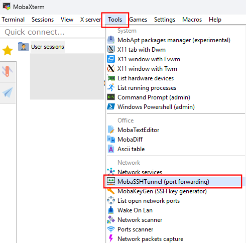
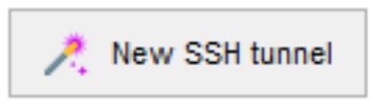
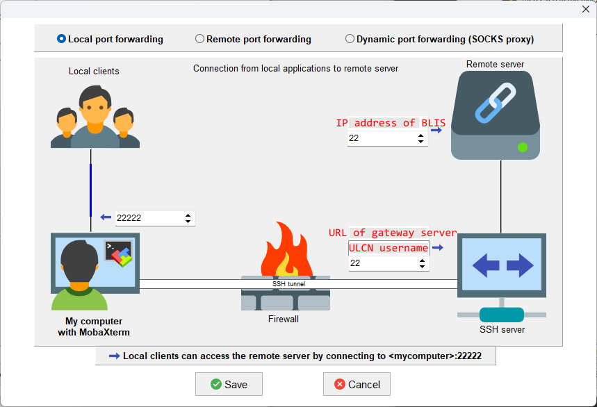
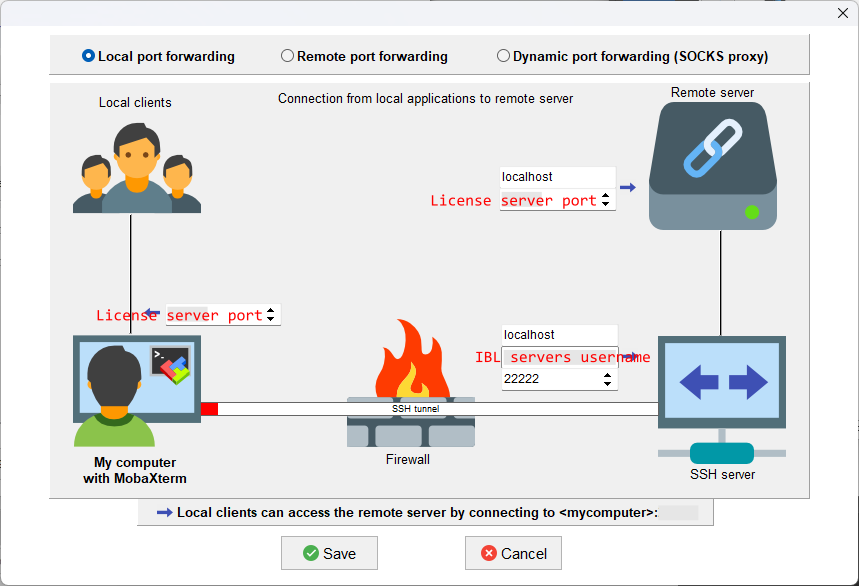
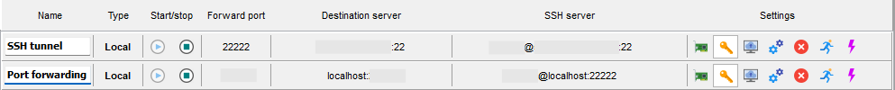
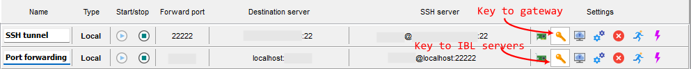
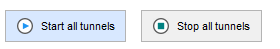
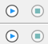
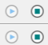

# Geneious floating license

*By C.Du [@snail123815](https://github.com/snail123815)*

Only IBL users can access this license. Please be advised that all instances of Geneious Prime usage are recorded. Unauthorized use may result in account suspension. Only the timestamp and the associated username are logged.

```{contents}
---
depth: 3
---
```

The Geneious prime floating license is hosted on BLIS, you need to be able to communicate to the specific port on BLIS in order to get the license. After you are done with your work, please do close your Geneious instance to release the license for others to use.

There are two ways to communicate to the port on BLIS:

1. You are in [Research Network](./Intro.md#what-is-research-network). IBL server account not needed, follow [Direct activation section](#direct-activation)
2. Not in Research Network:
    1. Ask for [IBL server account](./Intro.md#get-access), request the IP address of BLIS for Geneious prime.
    2. Ask for [SSH gateway access](./Intro.md#leiden-university-gateways), request connection to the IP address above.
    3. Follow [port forwarding section](#activate-through-ssh-port-forwarding)

## Direct activation

If your computer is University PC, you should be in Research Network, you can do direct activation to get a Geneious prime floating license. Here is how.

1. Fill in [request software](https://www.staff.universiteitleiden.nl/ict/help-and-support/application-forms/application-forms/science/institute-of-biology-leiden-ibl?cf=science&cd=institute-of-biology-leiden-ibl) form in your ISSC helpdesk, you can use any SAP number, it will not cost any. Wait for the confirmation from ISSC, install Geneious prime on your computer.
    - Please fill the "comments" section: "I am a user from IBL, and we have Geneious floating license server setup. Thus, I only need to install the latest version, and IBL will take care of the activation. Thank you very much!"
2. Send an email to us with your information, ask for **IP address of BLIS** and **port number of the license server**.
3. Once Geneious prime is installed, you can run it, select "Activate a Licence", or go to "help" -> "Activate Licence".
4. Select "License Server", put the **IP address of BLIS** as server, then change port to the **port number** you get from us.
5. Click "Activate", you should see "License Obtained" notification. This activation information will be stored for next time unless it is not accessible anymore.

## Activate through SSH port forwarding

Please make sure you can SSH connect to BLIS through the university SSH gateway server. Note that you need your **ULCN account** and password for the gateway and **IBL servers account** and password for BLIS.

You can download Geneious prime for your platform from here https://www.geneious.com/download, install it.

If you setup the connection using MobaXterm, you can continue to [MobaXterm port forwarding](#mobaxterm-port-forwarding). If your setup the connection using a terminal, then proceed to [SSH port forwarding](#commandline-ssh-port-forwarding).

### MobaXterm port forwarding

Start MobaXterm, find from the menu: Tools -> MobaSSHTunnel



<p>Click "New Tunnel" </p>

Create the first tunnel as shown below.



<p>Then click "New Tunnel" again  to create the second tunnel as shown below</p>



You can name the two tunnels like so:



If you followed the tutorial of [SSH key setup](../ssh%20access/ssh%20access%20mobaxterm.md), you can click the key buttons to setup connection use existing keys:



Now you can try to start the first one and then second one to see if there is any errors pop out. You need to use corresponding password. For the first tunnel with target port 22, you need to use ULCN password, for the second tunnel with target port of the license server, you need IBL server password.

Once tests are OK, you can use the two buttons to control the status of two tunnels



Please note the differences between not started  and started! 

Once Geneious prime is installed, you can run it
1. select "Activate a Licence", or go to "help" -> "Activate Licence".
2. Select "License Server", put the **localhost** as server, then change port to the **port number** you get from us. This is the local port (left) you set in the second tunnel.
3. Click "Activate", you should see "License Obtained" notification. This activation information will be stored for next time unless it is not accessible anymore.

### Commandline SSH port forwarding

You should be able to connect to BLIS using `ssh` command in your terminal.

*Assume* the **license server port** is 33333

Add `-L 33333:localhost:33333` while connecting to BLIS, for example:

```sh
ssh -L 33333:localhost:33333 user@blis
```

After connection is established, you can start Geneious prime and 
1. select "Activate a Licence", or go to "help" -> "Activate Licence".
2. Select "License Server", put the **localhost** as server, then change port to the **port number** you get from us. This is the local port (left) you set in the second tunnel.
3. Click "Activate", you should see "License Obtained" notification. This activation information will be stored for next time unless it is not accessible anymore.

You can also add `-N` to the SSH command to prevent a shell session.

You can set this up in the config file `~/.ssh/config`, just add one additional line starts with `LocalForward` to the config you use to connect BLIS:

```
Host BLIS_with_geneiousprime
    User USER
    HostName BLIS.IP.ADDRESS
    ProxyCommand ssh -A SSH.GATEWAY.SERVER -p 22 -q -W %h:%p
    LocalForward 33333 localhost:33333
    IdentityFile ~/.ssh/to_ibl_server
    AddKeysToAgent yes
    IdentitiesOnly yes
    ServerAliveInterval 60
    ServerAliveCountMax 10
```

Remember to change the corresponding part:
- BLIS IP address
- Gateway URL
- The port number `33333` to the one you get from us.

Then after you established an SSH connection using this config: `ssh BLIS_with_geneiousprime`, the activation also works.