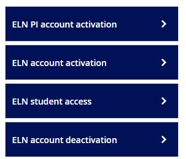

# Electronic Lab Notebook

*By C.Du [@snail123815](https://github.com/snail123815) & Joost Willemse[@Karivtan](https://github.com/Karivtan)*

IBL is **hosting** a ELN server providing a web application called Research Space (RSpace) <span style="background-color:#2558A4;padding:0.2rem;border-radius:3px;display:inline-flex;align-items:center;justify-content:center;width:58px"> </span>. This section helps you get started with using the ELN, including how to apply for an account, set up autosharing within your group, and find tutorial videos. We also provide links to faculty-level support resources for further assistance.

```{contents}
---
depth: 3
---
```

Adopting an ELN can feel awkward if you’re used to paper notebooks. Take it slowly and try things out with your group. Start by using the ELN simply as a cloud notebook: create entries, add text, and attach images. 

Practical tips:
- Begin with basic, frequent entries to build the habit; don’t try to move everything at once.
- Use the mobile app to upload photos of plates, gels or notes, but do not record or process sensitive or confidential data on personal devices — prefer institutional devices for that.
- Use templates, tags and clear titles to make notes easy to find later.
- Keep regular exports or backups of important notebooks where possible.
- Ask colleagues or ELN support for demonstrations and share experiences within your group.

Faculty level support can be found in [FWN-IM-Electronic Laboratory Notebook (ELN) (login required)](https://leidenuniv1.sharepoint.com/sites/FWN-Intranet/SitePages/FWN-IM-ELN-Home.aspx?xsdata=MDV8MDJ8Yy5kdUBiaW9sb2d5LmxlaWRlbnVuaXYubmx8MTgyNzgxM2QwMmRiNGY3NmJmODUwOGRlNjQ5M2I2OGZ8Y2EyYTdmNzZkYmQ3NGVjMDkxMDg2YjNkNTI0ZmI3Yzh8MHwwfDYzOTA1ODc4Mjc0OTcxMTgzNXxVbmt)

## ELN direct access URL

ELN (RSpace interface) - [https://leiden.researchspace.com/](https://leiden.researchspace.com/)

## Application entries

Check [Intro-application](./Intro.md#application) for the application process. After your ELN account is activated, you can login to the RSpace web interface and start using it.

There are three application entries and one deactivation entry in [ISSC helpdesk](https://helpdesk.universiteitleiden.nl/) → " "Research support" → "ELN"



- ELN **PI account activation**: for PIs to request a group account (equivalent to PI account) if it does not exist. Group name has to follow the convention: `IBL-[CLUSTER NAME]-[FIRST LETTER PI][Last name PI]` for example:
  - `IBL-MBH-GvanWezel`
  - `IBL-SCS-TAivelo`
- ELN **account activation**: for all employees including **PhD/PostDoc/Labmanager** to request. Fill in the "PI team" field correctly, so that the account can be linked to the right ELN lab group. If you are not sure about the group name, please ask your PI or contact IBL RDM support.
- ELN **student access**: for ***employees*** to apply for **student access**. Consider to set up the end date a bit later in case of any delay.
- ELN **account deactivation**: for lab managers to request account deactivation for users who leave the group.

More details about how to fill in these forms can be found in the [FWN-IM-Electronic Laboratory Notebook (ELN) Quick Reference Cards (login required)](https://leidenuniv1.sharepoint.com/sites/FWN-Intranet/SitePages/FWN-IM-ELN-QRCards.aspx?xsdata=MDV8MDJ8Yy5kdUBiaW9sb2d5LmxlaWRlbnVuaXYubmx8MTgyNzgxM2QwMmRiNGY3NmJmODUwOGRlNjQ5M2I2OGZ8Y2EyYTdmNzZkYmQ3NGVjMDkxMDg2YjNkNTI0ZmI3Yzh8MHwwfDYzOTA1ODc4Mjc0OTc0NTM3NnxV).

## Usage policy

[FWN-IM-Electronic Laboratory Notebook (ELN) Usage Policy (login required)](https://leidenuniv1.sharepoint.com/sites/FWN-Intranet/SitePages/FWN-IM-ELN-Usage%20Policy.aspx?xsdata=MDV8MDJ8Yy5kdUBiaW9sb2d5LmxlaWRlbnVuaXYubmx8MTgyNzgxM2QwMmRiNGY3NmJmODUwOGRlNjQ5M2I2OGZ8Y2EyYTdmNzZkYmQ3NGVjMDkxMDg2YjNkNTI0ZmI3Yzh8MHwwfDYzOTA1ODc4Mjc0OTczM)

Please read the usage policy carefully before using the ELN. Most important points are:
- Every account will be disabled after 6 months of inactivity
- ELN is not meant to be used as a bulk storage

## Setup autosharing within group

- Go to [Universeit Leiden RSpace](https://leiden.researchspace.com) and login with your ULCN account
Share all labjournals of all users with everyone in the whole group
- Go to my RSpace and activate autosharing, like this all items you create will be shared with the whole group
Share a single notebook with all users in the group
- If you only want to share a single notebook that is shared with everyone in the group please create that notebook in the shared folder of the group
Share a single notebook with users/groups within or outside the current group
- If you want to share a single notebook select that notebook, and click the share icon. Select the user or group and save the changes. Here you can also share to all users

## Tutorial videos
  
For ELN tutorials look here [FWN-RSpace ELN Inventory Training Videos](https://video.leidenuniv.nl/channel/FWN-RSpace%2BELN%2BInventory%2BTraining%2BVideos/283092772)
