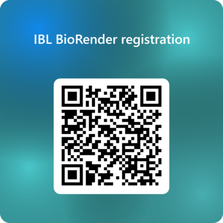

# RDM IBL Howtos

*By C.Du [@snail123815](https://github.com/snail123815) & J.Willemse [@Karivtan](https://github.com/Karivtan)*

```{contents}
---
depth: 3
---
```

RDM - Research data management, is an essential skill. Here we collect some protocols that you can directly follow to setup the most basic architectur. Including seting up **[Research Drive](./ResearchDrive.md)**, **[ELN](./ELN.md)** (electronic lab notebook), and (in the future) data archive.

We hope to achieve FAIR principles for research data produced in IBL:
- Findable — easy to locate
- Accessible — you can get the data under clear rules
- Interoperable — uses common formats so tools can work with it
- Reusable — well described so others can use it again

## Terminology

- NextCloud: A service which ResearchDrive is based on. It is used to manage your ResearchDrive files. It include a web interface and a local application.
- Cloud/Local storage: Cloud is files on a server you reach over the internet; local is files stored on your local computer.
- Virtual files: File placeholders that look real but download the data only when you open them, saving space. In Windows, virtual files often have a "Status" indicator, such as a cloud icon (online-only), a green check (locally available), or a solid green circle (always keep on this device).
- Hot storage: Fast, always-ready storage used for files you need right now.
- Cold storage: Cheaper, slower storage for files you rarely use but want to keep.

## IBL Research software support

IBL has a BioRender account that you can join only if you register with an `@biology.leidenuniv.nl` email address. The policy has been shared with PIs and will be included in the introduction material. The correct institute account (organisation) name is [**Leiden University - Institute of Biology**](https://app.biorender.com/portal/leiden-university-institute-biology).

Please fill in [this form](https://forms.cloud.microsoft/e/3wJqS3TBdi) (login required) when you join our institute. QR code to the form:



New accounts that cannot be found in this form will be removed.

Currently, IBL does not centrally fund discipline-specific commercial research software (for example **SnapGene** or **Geneious Prime**). Group leaders decide whether to use these tools and from which budget to pay. For students (including **PhD students** and **PostDocs**), licenses are usually significantly cheaper.