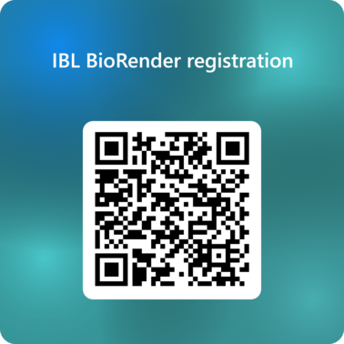

# RDM IBL Howtos

*By C.Du [@snail123815](https://github.com/snail123815) & J.Willemse [@Karivtan](https://github.com/Karivtan)*

```{contents}
---
depth: 3
---
```

RDM - Research data management, is an essential skill. It is the practice of organizing, storing, and sharing research data in a way that ensures its quality, integrity, and accessibility. Good RDM practices help researchers to manage their data effectively, comply with institutional and funding agency requirements, and facilitate data sharing and reuse. In IBL, we have two main tools for RDM:
- **[Research Drive](./ResearchDrive.md)**
- **[ELN](./ELN.md)** (electronic lab notebook)

We hope to achieve FAIR principles for research data produced in IBL:
- Findable — easy to locate
- Accessible — you can get the data under clear rules
- Interoperable — uses common formats so tools can work with it
- Reusable — well described so others can use it again

## Direct access URL

Research Drive (Nextcloud interface) - [https://universiteitleiden.data.surfsara.nl/](https://universiteitleiden.data.surfsara.nl/)  
ELN (RSpace interface) - [https://leiden.researchspace.com/](https://leiden.researchspace.com/)

## Terminology

- **Nextcloud** <span style="background-color:#3568b4;padding:0.2rem;border-radius:3px;display:inline-flex;align-items:center;justify-content:center;width:32px"> </span>: A service on which Research Drive is based. It is used to manage your Research Drive files and includes a web interface and a local application.
- **Cloud/Local storage**: **Cloud** means the file lives on Research Drive (a server you reach over the internet); **local** means the file is stored on your computer’s disk. If you want background, see [Cloud computing](https://en.wikipedia.org/wiki/Cloud_computing).
- **Virtual files**: File placeholders that look real but download the data only when you open them, saving space. In Windows, virtual files often have a "Status" indicator, such as a cloud icon (online-only), a green check (locally available), or a solid green circle (always keep on this device).
- **Hot storage**: Fast, always-ready storage used for files you need right now.
- **Cold storage**: Cheaper, slower storage for files you rarely use but want to keep.
- **ELN**: Electronic lab notebook, or electronic lab journal
- **RSpace**: also Research Space, <span style="background-color:#2558A4;padding:0.2rem;border-radius:3px;display:inline-flex;align-items:center;justify-content:center;width:58px"> </span>, a web application of our actual implementation of ELN.

```{note}
Storing files on Research Drive is **not a backup method**. Deleted files will be completely lost after the retention period (60 days). For critical data, especially raw data, consider sharing folders with "read only" permissions to prevent accidental deletion.
```

## PI preparation

For all your current projects, check the DMP and update the corresponding part to fit the new situation. Make sure the costs are covered by the project. For each project folder that you need, please assign a cost centre. ISSC is **not** centrally funding the first TB with a valid DMP, so there is no need to attach that; just mention the cost centre when filling in the form from the ISSC helpdesk. IBL will fund the first 0.5 TB of the PI umbrella project folder.

Optionally, fill out a DMP:
1. All projects that generate research data
2. Collaborative projects (you can use a collective DMP)
3. An umbrella DMP for your group (covering smaller topics that may not fit any project yet)

After drafting your DMP(s), contact ibl.rdm@biology.leidenuniv.nl to have them approved.  

## Application

- Request Research Drive per project/DMP/contract
  - [ISSC helpdesk](https://helpdesk.universiteitleiden.nl/)
  - Go to "Research support" → "Research Drive" → "Request Research Drive"
  - Choose **"No"** for DMP, **always use a cost centre** number in "SAP number:" field, ISSC has stopped support for DMP-based funding.
  - Mention the project folder name you want to create in "Comment:" field
- Request ELN group account (equivalent to PI account) if it does not exist
  - [ISSC helpdesk](https://helpdesk.universiteitleiden.nl/) Go to "Research support" → "ELN" → "ELN PI account activation"
  - Group name has to follow the following convention: `IBL-[CLUSTER NAME]-[FIRST LETTER PI][Last name PI]` for example:
    - IBL-MBH-GvanWezel
    - IBL-SCS-TAivelo
- All employees request an ELN account (PhD/PostDoc/Labmanager)
  - [ISSC helpdesk](https://helpdesk.universiteitleiden.nl/) Go to "Research support" → "ELN" → "ELN account activation"
  - Fill in the "PI team" field correctly, so that the account can be linked to the right ELN group
- Supervisors (PI/PhD/PostDoc) request an ELN account per (master/bachelor) student
  - [ISSC helpdesk](https://helpdesk.universiteitleiden.nl/) Go to "Research support" → "ELN" → "ELN student access"
  - Fill in the form correctly. For "Group" field, use the ELN group name of the supervisor (PI/PhD/PostDoc)
- Users install the Nextcloud desktop client from the company portal (Windows 11) or Managed Software Centre (macOS), and log in to Research Drive with their ULCN account. See [Research Drive documentation](./ResearchDrive.md#download-and-install-nextcloud-desktop-client) for details.

::: {admonition} ELN account deactivates after 6 months of inactivity
ELN accounts that have not been used for 6 months will be deactivated. If you need to reactivate an account, go to "Research support" → "ELN" → "ELN account activation"
:::

## IBL Research software support

Currently, IBL only support non-discipline-specific commercial research software, for example Research Space for ELN, Research Drive for research data storage, and BioRender for creating illustrative figures. For discipline-specific software, we recommend you to use the tools that are widely used in your field (and supported by your collaborators, if any). For example, for molecular biology **SnapGene** or **Geneious Prime**. Group leaders decide whether to use these tools and from which budget to pay. For early-career researchers (such as **Master's and PhD students** and **PostDocs**), licenses are usually significantly cheaper.

### IBL BioRender account

IBL has a BioRender account that you can join only if you register with an `@biology.leidenuniv.nl` email address. The policy has been shared with PIs and will be included in the introduction material. The correct institute account (organisation) name is [**Leiden University - Institute of Biology**](https://app.biorender.com/portal/leiden-university-institute-biology).

Please fill in [this form](https://forms.cloud.microsoft/e/3wJqS3TBdi) (login required) when you join the IBL BioRender institute account. QR code to the form:



New accounts that cannot be found in this form will be removed.
