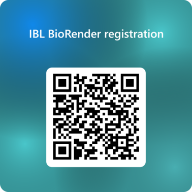

# RDM IBL Howtos

*By C.Du [@snail123815](https://github.com/snail123815) & J.Willemse [@Karivtan](https://github.com/Karivtan)*

IBL has two main tools for research data management (RDM): **Research Drive** for data storage and **ELN** (electronic lab notebook) for recording experiments. This section provides practical guides on how to use these tools effectively, including setup instructions, best practices, and troubleshooting tips.

```{contents}
---
depth: 3
---
```

RDM - Research data management, is an essential skill. It is the practice of organizing, storing, and sharing research data in a way that ensures its quality, integrity, and accessibility. Good RDM practices help researchers to manage their data effectively, comply with institutional and funding agency requirements, and facilitate data sharing and reuse. In IBL, we have two main tools for RDM:
- **[Research Drive](./ResearchDrive.md)**
- **[ELN](./ELN.md)** (electronic lab notebook)

We also cover how to use **GitHub or GitLab** in research. GitHub is useful for public or external collaboration, while the university-hosted GitLab is preferred for projects related to personal data but cannot be shared externally. See [GitHub or GitLab in research](./GitHub_in_research.md) for details.

We hope to achieve FAIR principles for research data produced in IBL:
- Findable — easy to locate
- Accessible — you can get the data under clear rules
- Interoperable — uses common formats so tools can work with it
- Reusable — well described so others can use it again

## Direct access URL

Research Drive (Nextcloud interface) - [https://universiteitleiden.data.surf.nl/](https://universiteitleiden.data.surf.nl/)  
ELN (RSpace interface) - [https://leiden.researchspace.com/](https://leiden.researchspace.com/)

```{note}
Storing files on Research Drive is **not a backup method**. Deleted files will be completely lost after the retention period (60 days). For critical data, especially raw data, consider sharing folders with "read only" permissions to prevent accidental deletion. See [Research Drive](./ResearchDrive.md) for what this means in practice.
```

## Getting access

- **Research Drive** — access is always by invitation from a PI or lab manager. If you have not been invited to a project folder, contact yours. PIs and lab managers requesting a new project folder should see [Set up and run a project folder](./ResearchDrive_admin.md).
- **ELN** — all employees, PIs and students apply through the ISSC helpdesk. The four application entries and how to fill them in are described in [ELN application entries](./ELN.md#application-entries).

## IBL Research software support

Currently, IBL only support non-discipline-specific commercial research software, for example Research Space for ELN, Research Drive for research data storage, and BioRender for creating illustrative figures. For discipline-specific software, we recommend you to use the tools that are widely used in your field (and supported by your collaborators, if any). For example, for molecular biology **SnapGene** or **Geneious Prime**. Group leaders decide whether to use these tools and from which budget to pay. For early-career researchers (such as **Master's and PhD students** and **PostDocs**), licenses are usually significantly cheaper.

### IBL BioRender account

IBL has a BioRender account that you can join only if you register with an `@biology.leidenuniv.nl` email address. The policy has been shared with PIs and will be included in the introduction material. The correct institute account (organisation) name is [**Leiden University - Institute of Biology**](https://app.biorender.com/portal/leiden-university-institute-biology).

Please fill in [this form](https://forms.cloud.microsoft/e/3wJqS3TBdi) (login required) when you join the IBL BioRender institute account. QR code to the form:



New accounts that cannot be found in this form will be removed.
