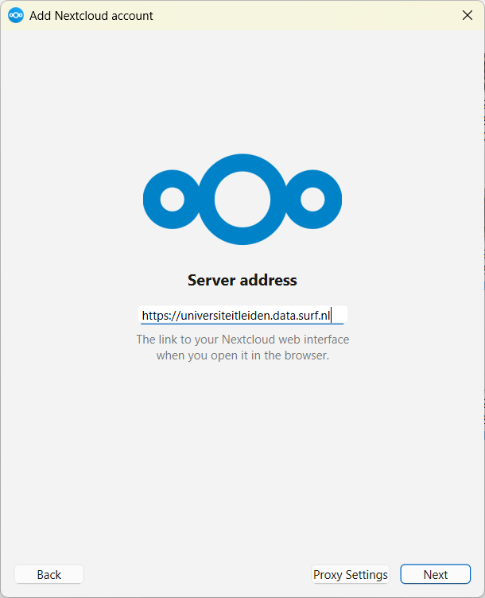
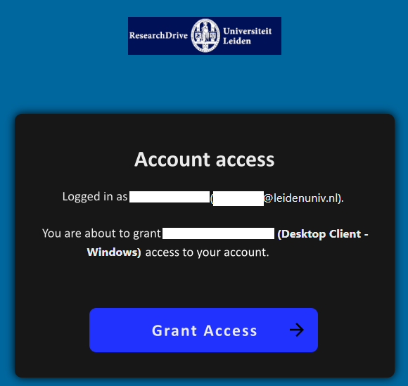
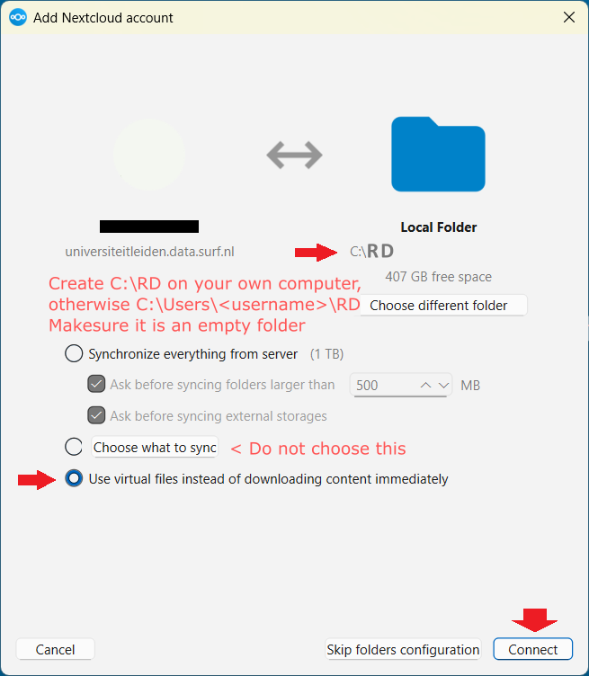
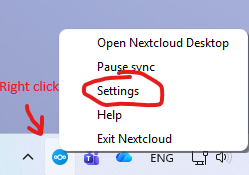
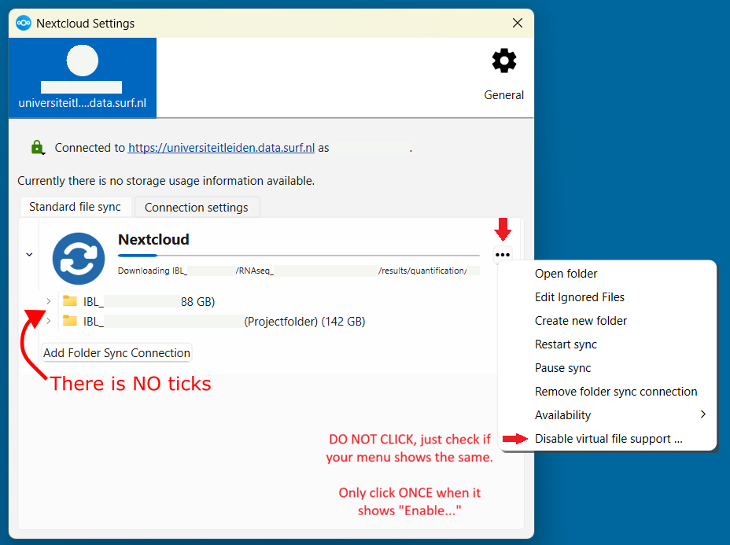

# Research Data Storage

*By C.Du [@snail123815](https://github.com/snail123815) & Joost Willemse[@Karivtan](https://github.com/Karivtan)*

[Research Drive](https://servicedesk.surf.nl/wiki/spaces/WIKI/pages/117178843/Research+Drive) is a cloud-based platform that enables researchers to securely store, share, and collaborate on data, and serves as an essential RDM tool for complying with the IBL RDM policy.

```{contents}
---
depth: 3
---
```

## Terminology

- Nextcloud <span style="background-color:#3568b4;padding:0.2rem;border-radius:3px;display:inline-flex;align-items:center;justify-content:center;width:32px"> </span>: A service on which Research Drive is based. It is used to manage your Research Drive files and includes a web interface and a local application.
- Cloud/Local storage: Cloud is files on a server you reach over the internet; local is files stored on your local computer.
- Virtual files: File placeholders that look real but download the data only when you open them, saving space. In Windows, virtual files often have a "Status" indicator, such as a cloud icon (online-only), a green check (locally available), or a solid green circle (always keep on this device).
- Hot storage: Fast, always-ready storage used for files you need right now.
- Cold storage: Cheaper, slower storage for files you rarely use but want to keep.
- ELN: Electronic lab notebook, or electronic lab journal
- RSpace: also Research Space, <span style="background-color:#2558A4;padding:0.2rem;border-radius:3px;display:inline-flex;align-items:center;justify-content:center;width:58px"> </span>, a web application of our actual implementation of ELN.

```{note}
Storing files on Research Drive is **not a backup method**. Deleted files will be completely lost after the retention period (30 days). For critical data, especially raw data, consider sharing folders with "read only" permissions to prevent accidental deletion.
```

## Workflow Getting Research Drive

Instruction made for research group in IBL

### Homework for PIs

Fill out DMP for:
1. All projects that generate research data
2. For collaborative project, you can use the collective DMP
3. An umbrela DMP for your group, consider all small topics that may not fit any project yet.

Contact ibl.rdm@biology.leidenuniv.nl to get them approved.

### Preparation and Application

- Request Research Drive per project/DMP
- Request ELN group account if it does not exist
- All employees request ELN account (PI/PhD/PostDoc/Labmanager)
- Supervisors (PI/PhD/PostDoc) request ELN account per (master/bachelor) student
- Users request Nextcloud software installation

### Setting Up and Invitation

After researchdrive has been activated, follow these steps:

- PI logs into [Research Drive](https://universiteitleiden.data.surf.nl)
- Go to dashboard (top left icon row, most right icon of this row)
- User accounts and invite all users, both staff and students.  
- Invite users using their official email address, for example the @biology mail for employees
- Go to the files and go into your project folder by clicking it
- Create a folder for each student/employee in this project
- Once the account is activated click the shared button next to the student/employee folder 
- Use the internal shares to add the correct users, set it to allow editing
- Users can now access data within the subfolder of the project.
- Never add any data to the root folder since this will not be synced
- Install NextCloud application from the company portal
- Open NextCloud once installed, click login
  
- Enter https://universiteitleiden.data.surf.nl, click Next
  
- Login with your ULCN account in the popup browser page
- Grant access when asked, then close the browser page
  
- Choose a folder to store the data, it has to be new or empty folder
  
- Press connect, all should be syncing now, you can see  in your system tray, which located on the bottom right (Windows) or top right (MacOS), expand the system tray if needed.
- Check your settings:
  - Right click on the next cloud icon  in system tray, left click on "Settings"
    
  - Use virtual files needs to be **enabled**
    
- You can access the data via the file browser

### Transfer large files from network drive

Transferring large files located on a network drive (for example, `J:`) to the cloud may require some extra steps.

Choose **one** of the following:

1. Recommended: [**Add** an additional sync folder, then **remove** the sync after uploading](./ResearchDrive_uploadFromNetworkDrive.md)
2. [RcloneView](https://rcloneview.com/) software (not for university computers)
3. [Rclone GUI](https://rclone.org/gui/)

#### Reasoning

Uploading files usually involves three steps:

1. Copy/move local files into the synced folder.
2. Nextcloud uploads these files to ResearchDrive (or other cloud storage).
3. If the files are not used, or if local storage is full, Nextcloud removes the local copies and replaces them with “virtual files”.

If you have large files located on your network drive, the first step can be difficult because you may not have enough local storage to hold them temporarily.
