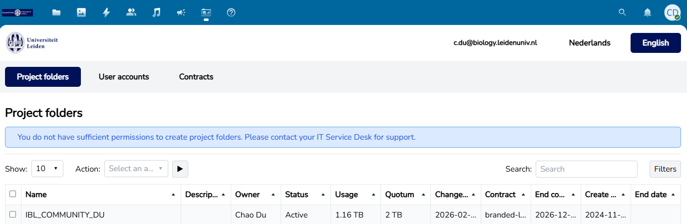
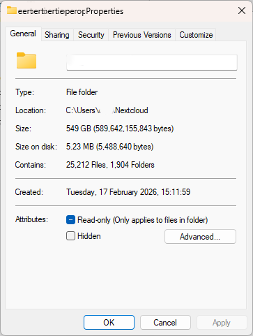
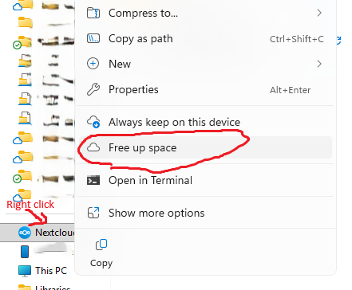

# Research Data Storage

*By C.Du [@snail123815](https://github.com/snail123815) & Joost Willemse[@Karivtan](https://github.com/Karivtan)*

[Research Drive](https://servicedesk.surf.nl/wiki/spaces/WIKI/pages/117178843/Research+Drive) is a cloud-based platform that enables researchers to securely store, share, and collaborate on data, and serves as an essential RDM tool for complying with the IBL RDM policy.

```{contents}
---
depth: 3
---
```

## Terminology

- **Nextcloud** <span style="background-color:#3568b4;padding:0.2rem;border-radius:3px;display:inline-flex;align-items:center;justify-content:center;width:32px"> </span>: A service on which Research Drive is based. It is used to manage your Research Drive files and includes a web interface and a local application.
- **Cloud/Local storage**: **Cloud** means the file lives on Research Drive (a server you reach over the internet); **local** means the file is stored on your computer’s disk. If you want background, see [Cloud computing](https://en.wikipedia.org/wiki/Cloud_computing).
- **Virtual files**: File placeholders that look real but download the data only when you open them, saving space. In Windows, virtual files often have a "Status" indicator, such as a cloud icon (online-only), a green check (locally available), or a solid green circle (always keep on this device).
- **Hot storage**: Fast, always-ready storage used for files you need right now.
- **Cold storage**: Cheaper, slower storage for files you rarely use but want to keep.
- **ELN**: Electronic lab notebook, or electronic lab journal
- **RSpace**: also Research Space, <span style="background-color:#2558A4;padding:0.2rem;border-radius:3px;display:inline-flex;align-items:center;justify-content:center;width:58px"> </span>, a web application of our actual implementation of ELN.

```{note}
Storing files on Research Drive is **not a backup method**. Deleted files will be completely lost after the retention period (60 days). For critical data, especially raw data, consider sharing folders with "read only" permissions to prevent accidental deletion.
```

## Research Drive intended structure


## Workflow Getting Research Drive

Instructions for research groups in IBL

### Homework for PIs

For all your current projects, check the DMP and update the corresponding part to fit the new situation. Make sure the costs are covered by the project. For each project folder that you need, please assign a cost centre. IBL will fund the first 0.5 TB of the PI umbrella project folder. ISSC is not centrally funding the first TB with a valid DMP, so there is no need to attach that; just mention the cost centre when filling in the form from the ISSC helpdesk.

Optionally, fill out a DMP for:
1. All projects that generate research data
2. Collaborative projects (you can use a collective DMP)
3. An umbrella DMP for your group (covering smaller topics that may not fit any project yet)

Contact ibl.rdm@biology.leidenuniv.nl to have them approved.

### Preparation and Application

- Request Research Drive per project/DMP
- Request ELN group account if it does not exist
- All employees request an ELN account (PI/PhD/PostDoc/Labmanager)
- Supervisors (PI/PhD/PostDoc) request an ELN account per (master/bachelor) student
- Users request Nextcloud software installation

::: {admonition} First-time login
Expect multiple login prompts and a missing project folder the first time you log in. This is because some things are only set up when you start using Research Drive. The project folder should appear a few minutes later.
:::

::: {admonition} It is **normal** to have "No permission to create a project folder"
On your "Dashboard" → "Project folders" page, you may see the message "You do not have sufficient permissions to create ...". This is normal: project folders can only be created by ISSC upon request.


:::

### Setting Up and Invitation

After Research Drive has been activated, follow these steps:

- PI logs in to [Research Drive](https://universiteitleiden.data.surf.nl)
- Go to the dashboard (top-left icon row, rightmost icon)
- Go to User accounts and invite all users, both staff and students
- Invite users using their official email address, for example the @biology mail for employees
- Go to the files and go into your project folder by clicking it
- Create a folder for each student/employee in this project
- Once the account is activated, click the "Shared" button next to the student/employee folder
- Use internal shares to add the correct users, and set permissions to allow editing
- Users can now access data within the subfolder of the project.
- Never add any data to the root folder, because it will not be synced
- Install the Nextcloud application from the company portal
- Open Nextcloud once installed and click Log in
  
- Enter https://universiteitleiden.data.surf.nl, click Next
  
- Log in with your ULCN account in the pop-up browser window
- Grant access when asked, then close the browser page
  
- Choose a folder to store the data; it must be a new or empty folder
  
- Click Connect. Sync should start; you can see  in your system tray, which is located on the bottom right (Windows) or top right (macOS). Expand the system tray if needed.
- Check your settings:
  - Right-click the Nextcloud icon  in the system tray, then left-click "Settings"
    
  - Virtual files must be **enabled**
    
- You can access the data via the file browser

### Space on your local machine

Research Drive uses the Nextcloud desktop client to *sync* files between the **cloud** (Research Drive) and your **local** computer.

If **Virtual files** are enabled (recommended), Windows Explorer can show files that exist in the cloud without storing the full data locally.

- Local vs cloud (practical meaning)
  - **Cloud**: The file exists on Research Drive and counts toward your project’s storage, even if it is not downloaded to your laptop/PC.
  - **Local**: The file’s data is present on your computer and consumes disk space.

You can think of “virtual files” as shortcuts/placeholders: they show up in Explorer so you can browse/search, but the content is only downloaded when you open it.

#### Windows “Properties” can show two different sizes

On Windows, right-click a file/folder → **Properties**. You may see:

- **Size**: the *logical* size of the file(s) (how much data it is in total).
  - Large, showing the real file size in the cloud.
- **Size on disk**: the *physical* space currently used on your local drive.
  - Zero or very small with virtual files, only metadata/placeholder data stored locally.



After you open a file (or mark it to keep offline), Windows downloads it and **Size on disk** will increase accordingly.

::: {admonition} Secure local space before opening
If you do not have enough space for the file you are opening, Nextcloud will try to reclaim space by converting downloaded local files to cloud, if not successfule, it report corrspnding error.
:::

#### Free up space (Windows)

If your local disk is getting full, you can remove local copies while keeping the files in Research Drive.

Common options in Windows Explorer (wording may vary slightly by Nextcloud client version):

1. In the synced Research Drive folder, right-click a file or folder.
2. Choose **Free up space**.
3. Sometimes the **Free up space** option is unavailable. This usually means **the selected file or folder** is already online-only (stored only in the cloud), so there is no local copy to remove. You can check the properties to confirm.



This converts downloaded files back to online-only (virtual) files:

- The data stays in Research Drive (cloud).
- The file remains visible in Explorer.
- Disk space is freed on your computer.

### Transfer large files from network drive

Transferring large files located on a network drive (for example, `J:`) to the cloud may require some extra steps.

Uploading files usually involves three steps:

1. Copy/move local files into the synced folder.
2. Nextcloud uploads these files to ResearchDrive (or other cloud storage).
3. If the files are not used, or if local storage is full, Nextcloud removes the local copies and replaces them with “virtual files”.

If you have large files located on your network drive, the first step can be difficult because you may not have enough local storage to hold them temporarily.

**Choose one of the following**:

1. Recommended: [**Add** an additional sync folder, then **remove** the sync after uploading](./ResearchDrive_uploadFromNetworkDrive.md)
2. [RcloneView](https://rcloneview.com/) software (not for university computers)
3. [Rclone GUI](https://rclone.org/gui/)

### Windows long path compatibility issue

On Windows, file paths can become too long for the operating system or for specific applications. Even on recent Windows versions, many tools still fail when the full path length approaches the legacy limit ([260 characters](https://learn.microsoft.com/en-us/windows/win32/fileio/maximum-file-path-limitation)). When this happens, files may not sync correctly and may not be usable locally.

```{warning}
If Windows cannot create a folder/file locally due to path length, the Nextcloud/Research Drive client cannot store it either. You may see sync errors.
```

#### Common scenarios where files cannot be stored (or synced)

- Deep folder nesting (many subfolders), especially when the local sync folder is already long (for example under `C:\RD`).
- Very long filenames, or filenames generated by software exports (for example, long sample IDs + many parameters in the name).
- Extracting archives (ZIP/TAR) into a synced folder: the extracted structure is often deeper than expected.
- Cloning software repositories into Research Drive (for example, projects containing `node_modules`, `venv`, `conda` environments, or other dependency trees).
- Workflows that auto-generate deeply nested output directories.

#### How to reduce the risk

- Use a short local sync root path (for example `C:\Users\<name>\RD` or simply `C:\RD` (if you are not sharing this computer with others) instead of a long path).
- Avoid unnecessary nesting; keep project folder structures shallow.
- Shorten filenames where possible; avoid encoding too much metadata in the name. Keep the metadata in a separate file when necessary.
- **Do not store dependency folders or full software environments in Research Drive**; keep those local.
- If you are on a managed university device and need Windows long path support enabled, contact ICT/ISSC. Enabling it typically requires admin rights, and note some applications still ignore the setting or report error while reading those files.
