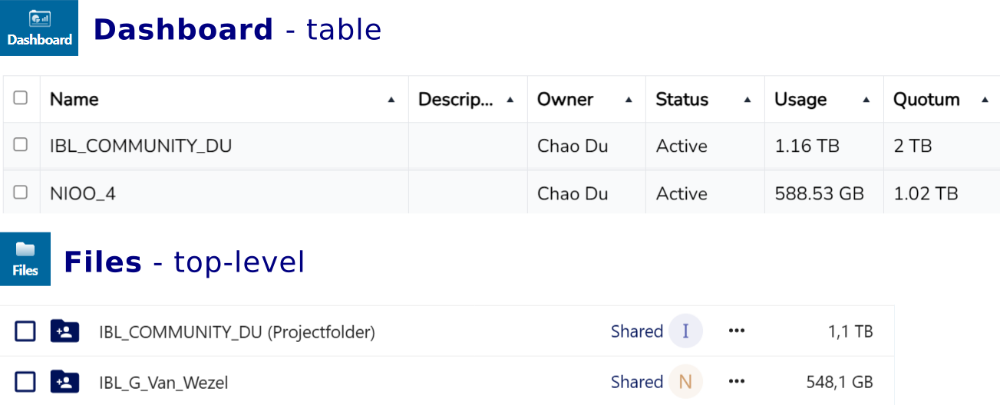

# Research Data Storage

*By C.Du [@snail123815](https://github.com/snail123815) & Joost Willemse[@Karivtan](https://github.com/Karivtan)*

[Research Drive](https://servicedesk.surf.nl/wiki/spaces/WIKI/pages/117178843/Research+Drive) is a cloud-based platform that enables researchers to securely store, share, and collaborate on data, and serves as an essential RDM tool for complying with the IBL RDM policy.

```{toctree}
---
hidden: true
maxdepth: 1
---
ResearchDrive_setup
ResearchDrive_troubleshooting
ResearchDrive_uploadFromNetworkDrive
ResearchDrive_commandLine
```

```{contents}
---
depth: 3
---
```

## Direct access URL

Leiden University Research Drive (Nextcloud interface) - [https://universiteitleiden.data.surfsara.nl/](https://universiteitleiden.data.surfsara.nl/)

**Topics not covered in this page**
- [Setting Up Local Sync](./ResearchDrive_setup.md) — Install and configure the Nextcloud desktop client to sync files with your local computer, including virtual files setup.
- [Managing Local Files](./ResearchDrive_troubleshooting.md) — Remove shared folders, manage local storage space, transfer large files from network drives, and resolve Windows long path issues.
- [Upload Data to ResearchDrive from Mapped Drives and USB Storage](./ResearchDrive_uploadFromNetworkDrive.md) — Step-by-step guide to upload large files from a network drive or USB storage without needing to copy them to your computer first, and how to remove the sync connection afterward.
- [Command Line Upload with rclone](./ResearchDrive_commandLine.md) — Use `rclone` to sync files from/to Research Drive using command line, which can be especially useful for Linux users on IBL servers or ALICE.

## Intended structure

Quick reference for the intended Research Drive folder structure.


## Nextcloud and Research Drive

**Nextcloud is the software platform that powers Research Drive.** It provides a user-friendly interface for managing files and folders, as well as features for sharing and collaboration. The Nextcloud desktop client allows you to sync files between your local computer and Research Drive, enabling you to access your data from anywhere with an internet connection.

## Application and invitation

To gain access to Research Drive, you **always need to be invited**. ISSC will create project folders upon request of PIs or lab managers, and then the PI or lab manager can invite the rest of the staff and students. If you do not have access to any project folder, please contact your PI or lab manager.

Requesting a project folder by PI or lab manager:
- Research Drive is now a paid service, please consult IBL RDM team for the cost and funding details.
- Request Research Drive per project/DMP/contract
  - [ISSC helpdesk](https://helpdesk.universiteitleiden.nl/)
  - Go to "Research support" → "Research Drive" → "Request Research Drive"
  - Choose **"No"** for DMP, **always use a cost centre** number in the field "SAP number:", ISSC has stopped DMP-based funding.
  - Mention the project folder name you want to create in "Comment:" field
- Invite your lab manager if you do not want to manage the Research Drive yourself. Give your lab manager full access to all your project folders, then the lab manager can then invite the rest of the staff and students and manage the major folder shares.
- See [Invite users and set up the folder structure:](#invite-users-and-set-up-the-folder-structure) section for details.

For **PhD/PostDoc/Researcher (staff)/student**, once you received the invitation, please follow the link and confirm you can login. Only after that, your PI or lab manager can give you access to your folder.

::: {admonition} Project folder name may not be consistent
Example:



Note in this example, `NIOO_4` is actually showing information for`IBL_G_Van_Wezel` folder.

You can rename a project folder in the **Files** tab, but the Dashboard name will not change (it reflects the owner's original name). If renaming is necessary, include an abbreviation of the original name, e.g. "New_name_0cnf_opn" (for "changed name from old project name"), so it remains identifiable. Also avoid [lengthy path problems](./ResearchDrive_troubleshooting.md#windows-long-path-compatibility-issue).
:::

### Invite users and set up the folder structure

After Research Drive has been activated, follow these steps to set up your project folder, invite users. This tutorial assumes you already have a project folder (if you are a PI) or have been invited to access at least one folder (if you are staff or student). If you do not have access to any project folder, please contact your PI or lab manager.

PI or authorized lab manager have full control over the project folder, you can decide how to organize the folder structure and who can access which folders. We recommend the following basic structure, but you can adjust it according to your needs:


**Anyone** with a Research Drive account can invite other users include:
- **Staff**: PhD students, PostDocs, Researcher (staff), Lab managers
- **Students**: Master students, Bachelor students, Interns
- **External collaborators**: collaborators from other institutions, they can be invited using their external email address, but they will be prompted to create their own [eduID](https://eduid.nl/home) account or use the account from their institute (if present in the system) before they can log in.

Steps:
- Logs in to [Research Drive](https://universiteitleiden.data.surf.nl)
- Go to the dashboard (top-left icon row, second icon from right)

::: {admonition} First-time login
Expect multiple login prompts and a missing project folder the first time you log in. This is because some things are only set up when you start using Research Drive. The project folder should appear a few minutes later.
:::

::: {admonition} It is **normal** to have zero space
(you-do-not-own-space)=
The University admin is the owner of all project folders, not yourself, even if you are a PI. So you do not "own" any space on Research Drive, this is **normal**. The project folder is *shared with you*, not counting as your own space.


But you do see your `Usage` and `Quotum` on your "Dashboard" → "Project folders" page. You may see the message "You do not have sufficient permissions to create ...". This is normal as well: project folders can only be created by ISSC upon request. 


:::

- Go to "Dashboard" → "User accounts" and invite all users, both staff and students, using their university email address (for example the @biology mail for employees).
  - For students without an university email address, you can use their personal email address, but make sure to inform them to check their inbox and confirm the invitation. For external collaborators, you can invite them using their external email address. They must first create their own [eduID](https://eduid.nl/home) account or use the account from their institute (if present in the system) before they can log in.
  - Once the first several staffs finish setting up, they can invite the rest of the staff and students.
- Invite users using their university email address, for example the @biology mail for employees
  - **External users** can gain access when you invite their external email address. They will be prompted to create their own [eduID](https://eduid.nl/home) account or use the account from their institute (if present in the system) before they can log in.
- Go to the **Files** tab (top left), and go into your **project folder**
- Create a folder for everyone in this project

Once the staff and student accounts are activated:
- Go to the **Files** tab, locate the target folder, and click the **"Shared"** button
  - Make sure the pop-up shows the correct folder name, click "Sharing" tab if not already selected
- In **Internal shares** section, add the correct users, and set permissions to allow editing (for their own folder only).
  - Same procedure for other files you want to share with specific users, but be careful with the permissions.
- Users can now access data within the subfolder of the project.

## Expand storage space

By default, each application creates a project folder with 0.5 TB of storage space. If you need more space, please specify the required storage size and the reason in the "Comment:" field when applying for Research Drive.

To expand existing project folder, please:
- [ISSC helpdesk](https://helpdesk.universiteitleiden.nl/)
- Go to "Research support" → "Research Drive" → "Ask a question"
- Fill the desired space you want to expand
- Explain how would you like to pay for the extra space, for example by mentioning the cost centre of the project that will cover the cost.

::: {admonition} Do not blindly expand storage of one project folder
Before requesting more space, consider whether the additional storage will actually be used in line with your project's Data Management Plan (DMP). Raw data that can be regenerated, large intermediate files, or software environments generally should not be kept in Research Drive long-term. If you find your storage is filling up quickly, it may be a sign to review your data retention strategy: archive or delete files that are no longer needed, avoid storing intermediate, regeneratable data, and check whether files from completed projects can be moved to long-term archival storage (tape) instead.
:::

### Different sizes in Dashboard and Files

Confusion will arise when checking your storage usage.

- In **"Files"** page, Research Drive uses binary prefixes, **although it is showing TB/GB, but it actually show numbers in TiB and GiB**.
  - 1 TiB = 2<sup>40</sup> bytes = 1024 GiB; 1 GiB = 2<sup>30</sup> bytes = 1024 MiB.
- In **"Dashboard"** page, it uses decimal prefixes
  - 1 TB = 10<sup>12</sup> bytes = 1000 GB; 1 GB = 10<sup>9</sup> bytes = 1000 MB. 
- 1 TB (decimal, "Dashboard") is approximately 0.91 TiB (binary, "Files"), 2 TB = approximately 1.82 TiB.
- 1 GB (decimal, "Dashboard") is approximately 0.93 GiB (binary, "Files"), 500 GB = approximately 465.66 GiB.


In this example, 1.16 TB in the "Dashboard" table is actually 1.06 TiB, which rounds up to 1.1 TB in "Files" page. 588.53 GB in "Dashboard" is actually 548.1 GiB. The "Files" page is more accurate for checking the actual size of your files, while the "Dashboard" page is more accurate for checking your quota.

**Quota is calculated using decimal prefixes.** So the "Dashboard" page is more accurate for checking your quota, while the "Files" page is more accurate for checking the actual size of your files. If you are close to your quota, consider archiving files to long-term storage or [requesting more storage](#expand-storage-space).

There is some **delay in showing the actual usage** in your Dashboard after you upload or delete files.
