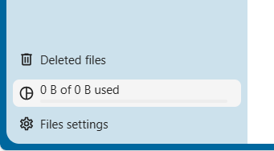
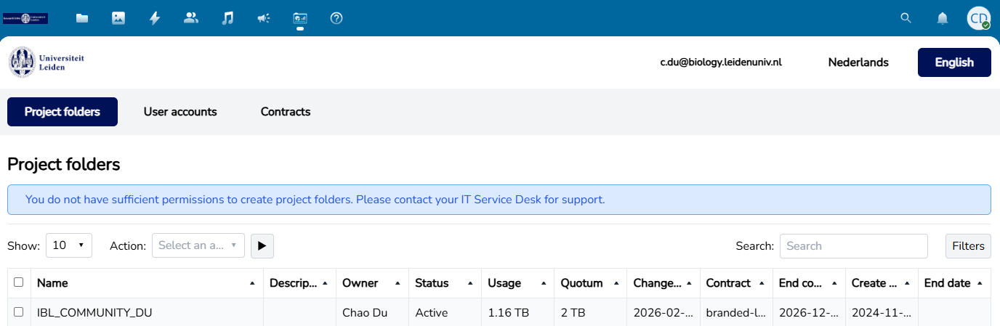
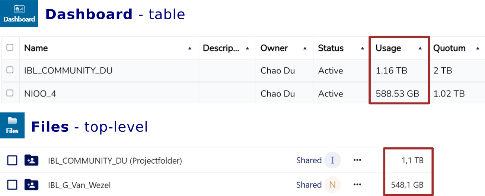
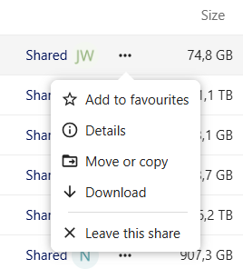
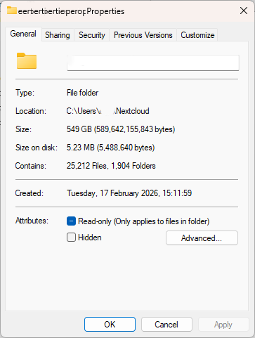
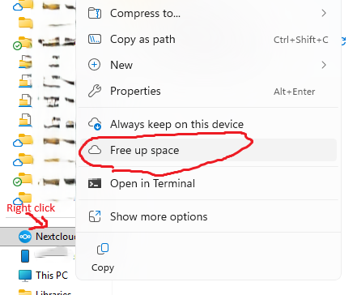

# Research Data Storage

*By C.Du [@snail123815](https://github.com/snail123815) & Joost Willemse[@Karivtan](https://github.com/Karivtan)*

[Research Drive](https://servicedesk.surf.nl/wiki/spaces/WIKI/pages/117178843/Research+Drive) is a cloud-based platform that enables researchers to securely store, share, and collaborate on data, and serves as an essential RDM tool for complying with the IBL RDM policy.

```{contents}
---
depth: 3
---
```

## Direct access URL

Research Drive (Nextcloud interface) - [https://universiteitleiden.data.surfsara.nl/](https://universiteitleiden.data.surfsara.nl/)

## Intended structure


## Nextcloud and Research Drive

**Nextcloud is the software platform that powers Research Drive.** It provides a user-friendly interface for managing files and folders, as well as features for sharing and collaboration. The Nextcloud desktop client allows you to sync files between your local computer and Research Drive, enabling you to access your data from anywhere with an internet connection.

## Application and invitation

For **PI**, you need to apply for it:
- Research Drive is now a paid service, please consult IBL RDM team for the cost and funding details.
- Request Research Drive per project/DMP/contract
  - [ISSC helpdesk](https://helpdesk.universiteitleiden.nl/)
  - Go to "Research support" → "Research Drive" → "Request Research Drive"
  - Choose **"No"** for DMP, **always use a cost centre** number in the field "SAP number:", ISSC has stopped DMP-based funding.
  - Mention the project folder name you want to create in "Comment:" field
- Invite your lab manager if you do not want to manage the Research Drive yourself. Give your lab manager full access to all your project folders, then the lab manager can then invite the rest of the staff and students and manage the major folder shares.
- See [Invite users and set up the folder structure:](#invite-users-and-set-up-the-folder-structure) section for details.

For **PhD/PostDoc/Researcher (staff)/student**, once you received the invitation, please follow the link and confirm you can login. Only after that, your PI or lab manager can give you access to your folder.

### Invite users and set up the folder structure

After Research Drive has been activated, follow these steps to set up your project folder, invite users. This tutorial assumes you already have a project folder (if you are a PI) or have been invited to access at least one folder (if you are staff or student). If you do not have access to any project folder, please contact your PI or lab manager.

**Anyone** with a Research Drive account can invite other users include:
- **Staff**: PhD students, PostDocs, Researcher (staff), Lab managers
- **Students**: Master students, Bachelor students, Interns
- **External collaborators**: collaborators from other institutions, they can be invited using their external email address, but they will be prompted to create their own [eduID](https://eduid.nl/home) account or use the account from their institute (if present in the system) before they can log in.

Steps:
- Logs in to [Research Drive](https://universiteitleiden.data.surf.nl)
- Go to the dashboard (top-left icon row, second icon from right)

::: {admonition} First-time login
Expect multiple login prompts and a missing project folder the first time you log in. This is because some things are only set up when you start using Research Drive. The project folder should appear a few minutes later.
:::

::: {admonition} It is **normal** to have zero space
(you-do-not-own-space)=
The University admin is the owner of all project folders, not yourself, even if you are a PI. So you do not "own" any space on Research Drive, this is **normal**. The project folder is *shared with you*, not counting as your own space.



But you do see your `Usage` and `Quotum` on your "Dashboard" → "Project folders" page. You may see the message "You do not have sufficient permissions to create ...". This is normal as well: project folders can only be created by ISSC upon request. 


:::

- Go to "Dashboard" → "User accounts" and invite all users, both staff and students, using their university email address (for example the @biology mail for employees).
  - For students without an university email address, you can use their personal email address, but make sure to inform them to check their inbox and confirm the invitation. For external collaborators, you can invite them using their external email address. They must first create their own [eduID](https://eduid.nl/home) account or use the account from their institute (if present in the system) before they can log in.
  - Once the first several staffs finish setting up, they can invite the rest of the staff and students.
- Invite users using their university email address, for example the @biology mail for employees
  - **External users** can gain access when you invite their external email address. They will be prompted to create their own [eduID](https://eduid.nl/home) account or use the account from their institute (if present in the system) before they can log in.
- Go to the **Files** tab (top left), and go into your **project folder**
- Create a folder for everyone in this project

Once the staff and student accounts are activated:
- Go to the **Files** tab, locate the target folder, and click the **"Shared"** button
  - Make sure the pop-up shows the correct folder name, click "Sharing" tab if not already selected
- In **Internal shares** section, add the correct users, and set permissions to allow editing (for their own folder only).
  - Same procedure for other files you want to share with specific users, but be careful with the permissions.
- Users can now access data within the subfolder of the project.

## Expand storage space

By default, each application creates a project folder with 0.5 TB of storage space. If you need more space, please specify the required storage size and the reason in the "Comment:" field when applying for Research Drive.

To expand existing project folder, please:
- [ISSC helpdesk](https://helpdesk.universiteitleiden.nl/)
- Go to "Research support" → "Research Drive" → "Ask a question"
- Fill the desired space you want to expand
- Explain how would you like to pay for the extra space, for example by mentioning the cost centre of the project that will cover the cost.

::: {admonition} Do not blindly expand storage of one project folder
Before requesting more space, consider whether the additional storage will actually be used in line with your project's Data Management Plan (DMP). Raw data that can be regenerated, large intermediate files, or software environments generally should not be kept in Research Drive long-term. If you find your storage is filling up quickly, it may be a sign to review your data retention strategy: archive or delete files that are no longer needed, avoid storing intermediate, regeneratable data, and check whether files from completed projects can be moved to long-term archival storage (tape) instead.
:::

### Research Drive itself use different calculations

Confusion will arise when checking your storage usage.

- In **"Files"** page, Research Drive uses binary prefixes, **although it is showing TB/GB, but it actually show numbers in TiB and GiB**.
  - 1 TiB = 2<sup>40</sup> bytes = 1024 GiB; 1 GiB = 2<sup>30</sup> bytes = 1024 MiB.
- In **"Dashboard"** page, it uses decimal prefixes
  - 1 TB = 10<sup>12</sup> bytes = 1000 GB; 1 GB = 10<sup>9</sup> bytes = 1000 MB. 
- 1 TB (decimal, "Dashboard") is approximately 0.91 TiB (binary, "Files"), 2 TB = approximately 1.82 TiB.
- 1 GB (decimal, "Dashboard") is approximately 0.93 GiB (binary, "Files"), 500 GB = approximately 465.66 GiB.



In this example, 1.16 TB in the "Dashboard" table is actually 1.06 TiB, which rounds up to 1.1 TB in "Files" page. 588.53 GB in "Dashboard" is actually 548.1 GiB. The "Files" page is more accurate for checking the actual size of your files, while the "Dashboard" page is more accurate for checking your quota.

**Quota is calculated using decimal prefixes.** So the "Dashboard" page is more accurate for checking your quota, while the "Files" page is more accurate for checking the actual size of your files. If you are close to your quota, consider archiving files to long-term storage or [requesting more storage](./ResearchDrive.md#expand-storage-space).

There is some **delay in showing the actual usage** in your Dashboard after you upload or delete files.

## Setup local sync (optional)

To access Research Drive files on your local computer, you can set up the Nextcloud desktop client to sync files between Research Drive and your local machine. This allows you to work with your data directly from your file explorer (Windows Explorer or macOS Finder).

More importantly, to **upload large files** (for example, raw data) to Research Drive, using the Nextcloud desktop client is often more reliable and efficient than uploading through the web interface. The desktop client can handle large file transfers better and can automatically retry if there are network interruptions.

With the Nextcloud desktop client, you can choose to sync specific folders or use the "virtual files" feature, which allows you to see all your files in Explorer/Finder without taking up local storage space until you open them. This is especially useful for managing large datasets without filling up your local disk.

### Install Nextcloud desktop client

For University Computer, please find Nextcloud desktop client in the **Company Portal** (Windows 11) or **Managed Software Centre** (macOS). For personal computer, you can download **"Nextcloud Files"** application from the [Nextcloud website](https://nextcloud.com/install/#install-clients). There is also Linux version available.

#### University Mac users

I have confirmed with ISSC that the Nextcloud from **Managed Software Centre** is already "Virtual files" version. However, it is still possible that the client may not be correct after update. If that is the case, please contact the ISSC helpdesk to request an update to the Nextcloud client with "Virtual files" support. This feature is important for efficient storage management and seamless access to Research Drive files on your local machine.

(select-virtual-files-version)=
#### Personal Mac users

Please make sure to select "Virtual files" desktop client to download, for example **"macOS Virtual files 12+ (64 bit, universal)"**, from the dropdown menu. The "Virtual files" version allows you to access your Research Drive files without taking up local storage space, which is inevitable for most research scenarios and is a standard practice.


### Set up Nextcloud desktop client and sync with Research Drive

- [Install the Nextcloud application](#install-nextcloud-desktop-client)
- Open Nextcloud once installed and click **Log in**  
  ```{image} ../_static/images/nextcloud_login_login.png
  :alt: login
  :width: 30em
  ```
- Enter the following URL and click **Next**  
  ```
  https://universiteitleiden.data.surf.nl
  ```
  ```{image} ../_static/images/nextcloud_login_URL.png
  :alt: Enter URL
  :width: 30em
  ```
- **Log in** with your ULCN account in the pop-up browser window
- **Grant access** when asked, then close the browser page  
  ```{image} ../_static/images/nextcloud_login_grantaccess.png
  :alt: Login and grant access
  :width: 30em
  ```
- Choose a folder to store the data; it must be a new or empty folder. **Please make sure to select a folder that is not synced by iCloud, OneDrive, or other services**. MacOS users should also avoid using the default "Documents" folder, which is often synced with iCloud and can cause issues. We recommend creating a new folder named "RD" (or similar) directly under your user directory (for example, `C:\Users\<name>\RD` on Windows or `/Users/<name>/RD` on macOS) to ensure it is not affected by other sync services and to minimize path length issues.
  - **MacOS users:**
    - You do not need to choose any file or folder to sync, the virtual file system will create a virtual drive for you, and you can access the data via the file browser. You can also choose to sync to a local folder if you prefer, but it is not required.
    - You will not see "User virtual files ..." option.
  - [Virtual files and "Choose what to sync" are mutually exclusive](#choose-what-to-sync-are-mutually-exclusive)
  ```{image} ../_static/images/nextcloud_login_chooselocation.png
  :alt: Choose sync location
  :width: 30em
  ```
- Click **Connect**. Sync should start; you can see  or <span></span> in your system tray located on the bottom right (Windows) or top right (macOS). Expand the system tray if needed.
- Check your settings:
  - Right-click the Nextcloud icon  in the system tray, then left-click "Settings"  
    ```{image} ../_static/images/nextcloud_systemtray.png
    :alt: NextCloud Settings
    ```
  - Virtual files **enabled**  
    ```{image} ../_static/images/nextcloud_login_checkvertualfileenabled.png
    :alt: Virtual files enabled in Windows 11
    :width: 45em
    ```
- For macOS users, you should see "Virtual files" is enabled by default. If not, you need to uninstall the current Nextcloud client and [download the version](#select-virtual-files-version) with "Virtual files" support. For University laptop users, please contact the ISSC helpdesk to request an update to the Nextcloud client with "Virtual files" support.
  ```{image} ../_static/images/nextcloud_enable_virtual_files_macos.jpg
  :alt: Virtual files enabled in macOS
  :width: 30em
  ```
- You can access the data via the file browser (Explorer on Windows, Finder on macOS). You should see the cloud icon on the project folder, that icon will change depending on whether the files are cloud-only or downloaded.
  ```{image} ../_static/images/nextcloud_locations.png
  :alt: Data access via file browser
  :width: 45em
  ```

::: {admonition} Create **Teams** and share within team
Sometimes you want to share a folder with all of your lab members or a specific subgroup. You can create **Teams** in the "Contacts" page (top bar), add the relevant users to that team, and then share the folder with the team instead of individual users. This way, when you add new members to the team, they will automatically have access to the shared folder.
:::

::: {admonition} Do not add data directly to the top-level Research Drive folder
Unlike OneDrive, [you do not own any space in Research Drive](#you-do-not-own-space) — everything is shared with you. When you open Research Drive, the first screen you see (the **top-level folder**) only shows folders that have been shared with you:

1. The project folder that belongs to a PI
2. Any other folder shared with you

Anything you create **directly in that top-level folder** is **not part of Research Drive** and will **not be synced** — it will be lost.

```{mermaid}
graph LR
    RD["🗄️ Research Drive (top-level folder — what you see when you open Research Drive)"]
    RD --> P1["📁 ProjectA  ← shared with you ✅"]
    RD --> P2["📁 ProjectB  ← shared with you ✅"]
    RD --> BAD1["❌ 📄 my_file.txt created by yourself  ← NOT synced, will be lost!"]
    RD --> BAD2["❌ 📂 my_folder created by yourself  ← NOT synced, will be lost!"]
    RD --> GOOD1["📄 data.txt shared by others  ← synced ✅"]
    P1 --> GOOD2["📂 subfolder created by yourself inside ProjectA  ← synced ✅"]
    style BAD1 fill:#ffcccc,stroke:#cc0000
    style BAD2 fill:#ffcccc,stroke:#cc0000
    style P1 fill:#ccffcc,stroke:#009900
    style P2 fill:#ccffcc,stroke:#009900
    style GOOD1 fill:#ccffcc,stroke:#009900
    style GOOD2 fill:#ccffcc,stroke:#009900
```
:::

### Removing a shared folder or file

In Research Drive, you **cannot delete folders** shared with you from your computer. This can only be done by using the "Leave this share" option in the \[**&middot;&middot;&middot;**\] menu in the web interface.



However, deleting a shared **file** is **possible**. It does **not** delete it from the cloud — it removes **your** share (i.e., you leave the share by deleting the file). To regain access, you need to contact the person who originally shared it with you.

::: {admonition} Non-destructive, but non-reversible
:class: warning
When you delete a shared file or leave a shared folder, it is not deleted from the cloud, but it is also not recoverable from your side. You will lose access to that file or folder unless the original sharer (ISSC for project folders) shares it with you again. Therefore, be cautious when deleting shared files, as it can lead to loss of access to important data.
:::

### Space on your local machine

Research Drive uses the Nextcloud desktop client to *sync* files between the **cloud** (Research Drive) and your **local** computer.

When **Virtual files** are enabled (recommended), Windows Explorer or Finder on macOS can show files that exist in the cloud without storing the full data locally.

- Local vs cloud (practical meaning)
  - **Cloud**: The file exists on Research Drive and counts toward your project’s storage, even if it is not downloaded to your laptop/PC.
  - **Local**: The file’s data is present on your computer and consumes disk space.

You can think of “virtual files” as shortcuts/placeholders: they show up in Explorer or Finder so you can browse/search, but the content is only downloaded when you open it.


:::{admonition} Virtual files and "Choose what to sync" are mutually exclusive
(choose-what-to-sync-are-mutually-exclusive)=
The "Choose what to sync" option allows you to select specific folders to sync locally, but it is not compatible with virtual files. If you enable "Choose what to sync", you will lose the virtual file functionality, and all files in the synced folders will be downloaded to your local machine. Therefore, it is recommended to keep "Choose what to sync" disabled and use virtual files to manage your storage efficiently.
:::

#### Windows “Properties” can show two different sizes

On Windows, right-click a file/folder → **Properties**. You may see:

- **Size**: the *logical* size of the file(s) (how much data it is in total).
  - Large, showing the real file size in the cloud.
- **Size on disk**: the *physical* space currently used on your local drive.
  - Zero or very small with virtual files, only metadata/placeholder data stored locally.



After you open a file (or mark it to keep offline), Windows downloads it and **Size on disk** will increase accordingly.

::: {admonition} Secure local space before opening
If you do not have enough space for the file you are opening, Nextcloud will try to reclaim space by converting downloaded local files to cloud. If it is not successful, it will report a corresponding error.
:::

#### Free up space (Windows)

If your local disk is getting full, you can remove local copies while keeping the files in Research Drive.

Common options in Windows Explorer (wording may vary slightly by Nextcloud client version):

1. In the synced Research Drive folder, right-click a file or folder.
2. Choose **Free up space**.
3. Sometimes the **Free up space** option is unavailable. This usually means **the selected file or folder** is already online-only (stored only in the cloud), so there is no local copy to remove. You can check the properties to confirm.



This converts downloaded files back to online-only (virtual) files:

- The data stays in Research Drive (cloud).
- The file remains visible in Explorer.
- Disk space is freed on your computer.

### Transfer large files from network drive

Transferring large files located on a network drive (for example, `J:`) to the cloud may require some extra steps.

Uploading files usually involves three steps:

1. Copy/move local files into the synced folder.
2. Nextcloud uploads these files to ResearchDrive (or other cloud storage).
3. If the files are not used, or if local storage is full, Nextcloud removes the local copies and replaces them with “virtual files”.

If you have large files located on your network drive, the first step can be difficult because you may not have enough local storage to hold them temporarily.

**Choose one of the following**:

1. Recommended: [**Add** an additional sync folder, then **remove** the sync after uploading](./ResearchDrive_uploadFromNetworkDrive.md)
2. [RcloneView](https://rcloneview.com/) software (not for university computers)
3. [Rclone GUI](https://rclone.org/gui/)

### Windows long path compatibility issue

On Windows, file paths can become too long for the operating system or for specific applications. Even on recent Windows versions, many tools still fail when the full path length approaches the legacy limit ([260 characters](https://learn.microsoft.com/en-us/windows/win32/fileio/maximum-file-path-limitation)). When this happens, files may not sync correctly and may not be usable locally.

```{warning}
If Windows cannot create a folder/file locally due to path length, the Nextcloud/Research Drive client cannot store it either. You may see sync errors.
```

#### Common scenarios where files cannot be stored (or synced)

- Deep folder nesting (many subfolders), especially when the local sync folder is already long (for example under `C:\RD`).
- Very long filenames, or filenames generated by software exports (for example, long sample IDs + many parameters in the name).
- Extracting archives (ZIP/TAR) into a synced folder: the extracted structure is often deeper than expected.
- Cloning software repositories into Research Drive (for example, projects containing `node_modules`, `venv`, `conda` environments, or other dependency trees).
- Workflows that auto-generate deeply nested output directories.

#### How to reduce the risk

- Use a short local sync root path (for example `C:\Users\<name>\RD` or simply `C:\RD` (if you are not sharing this computer with others) instead of a long path).
- Avoid unnecessary nesting; keep project folder structures shallow.
- Shorten filenames where possible; avoid encoding too much metadata in the name. Keep the metadata in a separate file when necessary.
- **Do not store dependency folders or full software environments in Research Drive**; keep those local.
- If you are on a managed university device and need Windows long path support enabled, contact ICT/ISSC. Enabling it typically requires admin rights, and note some applications still ignore the setting or report error while reading those files.
