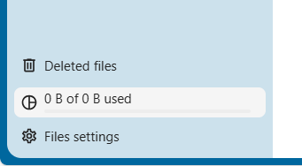
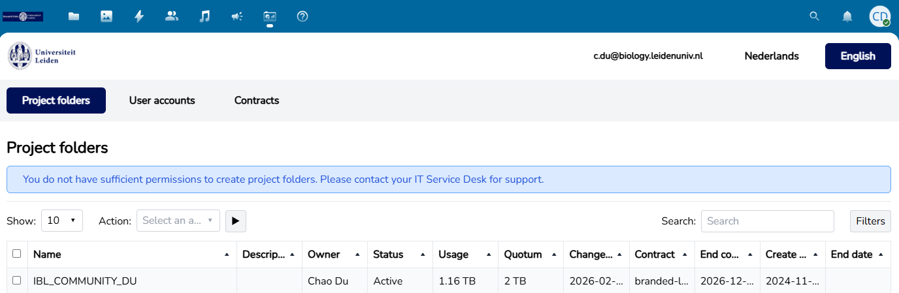
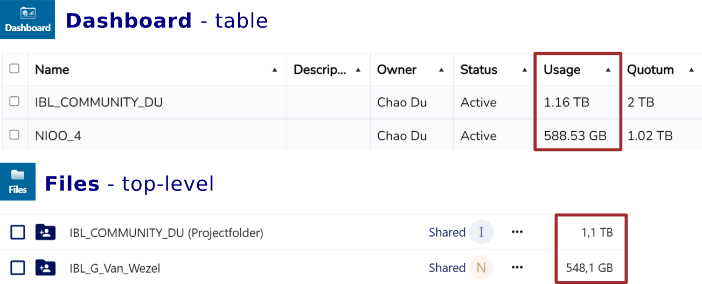

# Research Drive

*By C.Du [@snail123815](https://github.com/snail123815) & Joost Willemse [@Karivtan](https://github.com/Karivtan)*

[Research Drive](https://servicedesk.surf.nl/wiki/spaces/WIKI/pages/117178843/Research+Drive) is a
cloud-based platform that enables researchers to securely store, share, and collaborate on data,
and serves as an essential RDM tool for complying with the IBL RDM policy.

**Nextcloud is the software platform that powers Research Drive.** It provides the web interface
for managing files and folders and the sharing features, and the Nextcloud desktop client syncs
files between your computer and Research Drive.

## Direct access URL

Leiden University Research Drive (Nextcloud interface) -
[https://universiteitleiden.data.surf.nl/](https://universiteitleiden.data.surf.nl/)

```{note}
Storing files on Research Drive is **not a backup method**. Deleted files will be completely lost
after the retention period (60 days). For critical data, especially raw data, consider sharing
folders with "read only" permissions to prevent accidental deletion.
```

```{toctree}
---
hidden: true
maxdepth: 1
---
ResearchDrive_setup
ResearchDrive_transfer
ResearchDrive_uploadFromNetworkDrive
ResearchDrive_commandLine
ResearchDrive_troubleshooting
ResearchDrive_admin
```

```{contents}
---
depth: 3
---
```

## Where to go next

Pick the one that matches what you are trying to do:

- [Set up sync on your computer](./ResearchDrive_setup.md) — install and configure the Nextcloud
  desktop client so Research Drive appears in Explorer or Finder, including virtual files.
- [Choose how to move your data](./ResearchDrive_transfer.md) — start here if you have a lot of
  data to move and are not sure which method to use.
- [Upload from a network drive or USB](./ResearchDrive_uploadFromNetworkDrive.md) — move large data
  off a mapped drive (for example `J:`) or USB storage without copying it to your computer first.
- [Command line upload with `rclone`](./ResearchDrive_commandLine.md) — sync from a shell, which is
  usually what you want on an IBL server or ALICE.
- [Common issues and troubleshooting](./ResearchDrive_troubleshooting.md) — sync stuck, disk
  filling up, long path errors, removing a share.
- [Set up and run a project folder](./ResearchDrive_admin.md) — apply for a project folder, invite
  users, set share permissions, request more space.

## Key concepts

- **Nextcloud** <span style="background-color:#3568b4;padding:0.2rem;border-radius:3px;display:inline-flex;align-items:center;justify-content:center;width:32px"> </span>: The service Research Drive is built on. It provides the web interface and the desktop client used to manage your Research Drive files.
- **Cloud/Local storage**: **Cloud** means the file lives on Research Drive (a server you reach over the internet); **local** means the file is stored on your computer's disk. If you want background, see [Cloud computing](https://en.wikipedia.org/wiki/Cloud_computing).
- **Virtual files**: File placeholders that look real but download the data only when you open them, saving space. In Windows, virtual files often have a "Status" indicator, such as a cloud icon (online-only), a green check (locally available), or a solid green circle (always keep on this device).
- **Hot storage**: Fast, always-ready storage used for files you need right now.
- **Cold storage**: Cheaper, slower storage for files you rarely use but want to keep.

## Getting access

You **always need to be invited**. ISSC creates project folders on request from PIs or lab
managers, and the PI or lab manager then invites the rest of the staff and students. **If you do
not have access to any project folder, contact your PI or lab manager** — you cannot request one
for yourself.

Once you receive the invitation, follow the link and confirm that you can log in. Only after that
can your PI or lab manager give you access to your folder.

::: {admonition} First-time login
The first time you log in, you may be asked to log in more than once, and your project folder may
not be there yet. This is normal. Wait a few minutes and reload the page — your account is still
being set up.
:::

If you are the person who needs to *create* a project folder and invite others, see
[Set up and run a project folder](./ResearchDrive_admin.md).

## Storage space and quota

By default, each project folder is created with 0.5 TB of storage space. Research Drive is a paid
service; IBL funds the first 0.5 TB of the PI umbrella project folder. To request more, see
[Expand storage space](./ResearchDrive_admin.md#expand-storage-space).

(you-do-not-own-space)=
::: {admonition} It is **normal** to have zero space
The University admin is the owner of all project folders, not yourself, even if you are a PI. So
you do not "own" any space on Research Drive, this is **normal**. The project folder is *shared
with you*, not counting as your own space.



But you do see your `Usage` and `Quotum` on your "Dashboard" → "Project folders" page. You may see
the message "You do not have sufficient permissions to create ...". This is normal as well: project
folders can only be created by ISSC upon request.


:::

### Different sizes in Dashboard and Files

Confusion will arise when checking your storage usage.

- In **"Files"** page, Research Drive uses binary prefixes, **although it is showing TB/GB, but it actually show numbers in TiB and GiB**.
  - 1 TiB = 2<sup>40</sup> bytes = 1024 GiB; 1 GiB = 2<sup>30</sup> bytes = 1024 MiB.
- In **"Dashboard"** page, it uses decimal prefixes
  - 1 TB = 10<sup>12</sup> bytes = 1000 GB; 1 GB = 10<sup>9</sup> bytes = 1000 MB.
- 1 TB (decimal, "Dashboard") is approximately 0.91 TiB (binary, "Files"), 2 TB = approximately 1.82 TiB.
- 1 GB (decimal, "Dashboard") is approximately 0.93 GiB (binary, "Files"), 500 GB = approximately 465.66 GiB.



In this example, 1.16 TB in the "Dashboard" table is actually 1.06 TiB, which rounds up to 1.1 TB
in "Files" page. 588.53 GB in "Dashboard" is actually 548.1 GiB.

**Quota is calculated using decimal prefixes.** So the "Dashboard" page is more accurate for
checking your quota, while the "Files" page is more accurate for checking the actual size of your
files. If you are close to your quota, consider archiving files to long-term storage or
[requesting more storage](./ResearchDrive_admin.md#expand-storage-space).

There is some **delay in showing the actual usage** in your Dashboard after you upload or delete
files.

## Intended structure

Quick reference for the intended Research Drive folder structure. PIs and lab managers can adjust
it to their needs — see
[Invite users and set up the folder structure](./ResearchDrive_admin.md#invite-users-and-set-up-the-folder-structure).


