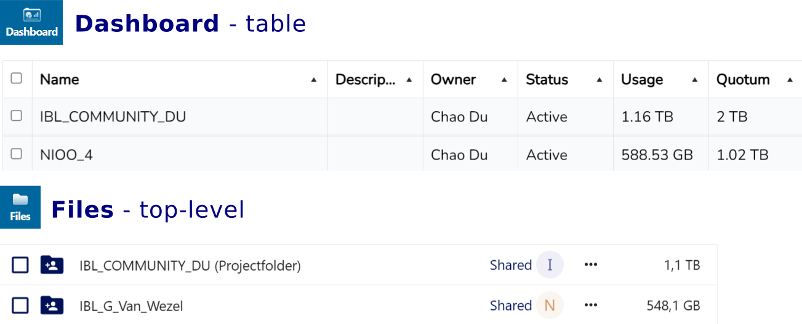

# Set up and run a project folder

*By C.Du [@snail123815](https://github.com/snail123815) & Joost Willemse [@Karivtan](https://github.com/Karivtan)*

This page covers **owning** a Research Drive project folder: preparing for it, requesting it from
ISSC, inviting your people, organising the folder structure, setting share permissions, and asking
for more space.

You need this page if you are a PI or a lab manager setting up storage for a project. If you are
instead trying to get *your own* data in and out of a folder that has already been shared with
you, start at [Research Drive](./ResearchDrive.md) — most people need both pages at different
times.

```{contents}
---
depth: 3
---
```

## Preparation

For all your current projects, check the DMP and update the corresponding part to fit the new
situation. Make sure the costs are covered by the project. For each project folder that you need,
please assign a cost centre. ISSC is **not** centrally funding the first TB with a valid DMP, so
there is no need to attach that; just mention the cost centre when filling in the form from the
ISSC helpdesk. IBL will fund the first 0.5 TB of the PI umbrella project folder.

Optionally, fill out a DMP:

1. All projects that generate research data
2. Collaborative projects (you can use a collective DMP)
3. An umbrella DMP for your group (covering smaller topics that may not fit any project yet)

After drafting your DMP(s), contact <ibl.rdm@biology.leidenuniv.nl> to have them approved.

## Apply for a project folder

Access to Research Drive is **always by invitation**. ISSC creates project folders on request from
PIs or lab managers; the PI or lab manager then invites the rest of the staff and students.

- Research Drive is a paid service. Please consult the IBL RDM team for cost and funding details.
- Request Research Drive per project/DMP/contract:
  - [ISSC helpdesk](https://helpdesk.universiteitleiden.nl/)
  - Go to "Research support" → "Research Drive" → "Request Research Drive"
  - Choose **"No"** for DMP, and **always use a cost centre** number in the "SAP number:" field —
    ISSC has stopped DMP-based funding.
  - Mention the project folder name you want to create in the "Comment:" field
- Invite your lab manager if you do not want to manage the Research Drive yourself. Give your lab
  manager full access to all your project folders; the lab manager can then invite the rest of the
  staff and students and manage the major folder shares.

For **PhD/PostDoc/Researcher (staff)/student**: once you receive the invitation, follow the link
and confirm you can log in. Only after that can your PI or lab manager give you access to your
folder.

::: {admonition} Project folder name may not be consistent
Example:



Note in this example, `NIOO_4` is actually showing information for `IBL_G_Van_Wezel` folder.

You can rename a project folder in the **Files** tab, but the Dashboard name will not change (it
reflects the owner's original name). If renaming is necessary, include an abbreviation of the
original name, e.g. "New_name_0cnf_opn" (for "changed name from old project name"), so it remains
identifiable. Also avoid [lengthy path problems](./ResearchDrive_troubleshooting.md#windows-long-path-compatibility-issue).
:::

## Invite users and set up the folder structure

After Research Drive has been activated, follow these steps to set up your project folder and
invite users. This assumes you already have a project folder (if you are a PI) or have been
invited to access at least one folder (if you are staff or student). If you do not have access to
any project folder, please contact your PI or lab manager.

PI or authorized lab manager have full control over the project folder: you decide how to organise
the folder structure and who can access which folders. We recommend the
[intended folder structure](./ResearchDrive.md#intended-structure), but you can adjust it
according to your needs.

**Anyone** with a Research Drive account can invite other users, including:

- **Staff**: PhD students, PostDocs, Researcher (staff), Lab managers
- **Students**: Master students, Bachelor students, Interns
- **External collaborators**: collaborators from other institutions. They can be invited using
  their external email address, but will be prompted to create their own
  [eduID](https://eduid.nl/home) account, or use the account from their institute (if present in
  the system), before they can log in. If you share with "Allow download and sync" enabled (which
  is *not* the same as allowing "Edit"), they can access the files just like internal users,
  including via [command line `rclone`](./ResearchDrive_commandLine.md) and the
  [Nextcloud desktop client](./ResearchDrive_setup.md).

Steps:

- Log in to [Research Drive](https://universiteitleiden.data.surf.nl)
- Go to the dashboard (top-left icon row, second icon from right)

::: {admonition} First-time login
The first time you log in, you may be asked to log in more than once, and your project folder may
not be there yet. This is normal. Wait a few minutes and reload the page — your account is still
being set up.
:::

- Go to "Dashboard" → "User accounts" and invite all users, both staff and students, using their
  university email address (for example the @biology mail for employees).
  - For students without a university email address, you can use their personal email address, but
    make sure to inform them to check their inbox and confirm the invitation.
  - For external collaborators, invite them using their external email address. They must first
    create their own [eduID](https://eduid.nl/home) account, or use the account from their
    institute (if present in the system), before they can log in.
  - Once the first several staff finish setting up, they can invite the rest of the staff and
    students.
- Go to the **Files** tab (top left), and go into your **project folder**
- Create a folder for everyone in this project
- Tell your users to install the Nextcloud desktop client from the Company Portal (Windows 11) or
  Managed Software Centre (macOS) and log in with their ULCN account — see
  [Install Nextcloud desktop client](./ResearchDrive_setup.md#install-nextcloud-desktop-client)

```{tip}
Users will see "0B of 0B used" and may report it as a problem. That is expected — see
{ref}`It is normal to have zero space <you-do-not-own-space>`.
```

## Set up share with users

The user needs to have already accepted the invitation and be able to log in to the Research Drive
web interface before you can share a folder with them. It is recommended to follow the
[intended folder structure](./ResearchDrive.md#intended-structure) and share the folders
accordingly.

Here is how to share a folder with specific users:

- Go to the **Files** tab, locate the target folder, and click the **"Shared"** button, or click
  the "..." (three dots) button and select **"Details"** from the dropdown menu.

  ```{image} ../_static/images/nextcloud_share_1.png
  :alt: share button
  :width: 30em
  ```

  - Make sure the pop-up shows the correct folder name, click "Sharing" tab if not already selected
- In **Internal shares** section, search and add the correct users (*or team name if you already
  created one*), and set permissions to allow editing (for their own folder only).

  ```{image} ../_static/images/nextcloud_share_2.png
  :alt: sharing tab
  :width: 23em
  ```

  - Remember to click **Save Share** after adding each user.

    ```{image} ../_static/images/nextcloud_share_3.png
    :alt: save share button
    :width: 15em
    ```

  - After saving, it should show the user added.

    ```{image} ../_static/images/nextcloud_share_4.png
    :alt: saved share
    :width: 15em
    ```

### Upload only folder

For folders that are meant for users to upload files but not edit or delete files, you can set the
permission to "Create" only. This way, users can only upload files to this folder, but cannot edit
or delete any files in it.

```{image} ../_static/images/nextcloud_share_5.png
:alt: advanced sharing options
:width: 15em
```

## Share with a group of users

If you want to share a folder with a group of users — all of your lab members, or a specific
subgroup — create a **Team** in the "Contacts" card, then share the folder with that team. You
then only manage the team membership, and sharing updates automatically: when you add a new member
to the team, they immediately have access to everything shared with it.

```{image} ../_static/images/nextcloud_share_6.png
:alt: Create a team in contacts
:width: 40em
```

## Expand storage space

By default, each application creates a project folder with 0.5 TB of storage space. If you need
more space, please specify the required storage size and the reason in the "Comment:" field when
applying for Research Drive.

To expand an existing project folder:

- [ISSC helpdesk](https://helpdesk.universiteitleiden.nl/)
- Go to "Research support" → "Research Drive" → "Ask a question"
- Fill in the desired space you want to expand to
- Explain how you would like to pay for the extra space, for example by mentioning the cost centre
  of the project that will cover the cost.

::: {admonition} Do not blindly expand storage of one project folder
Before requesting more space, consider whether the additional storage will actually be used in line
with your project's Data Management Plan (DMP). Raw data that can be regenerated, large
intermediate files, or software environments generally should not be kept in Research Drive
long-term. If you find your storage is filling up quickly, it may be a sign to review your data
retention strategy: archive or delete files that are no longer needed, avoid storing intermediate,
regeneratable data, and check whether files from completed projects can be moved to long-term
archival storage (tape) instead.

In particular, [do not store dependency folders or software environments in Research
Drive](./ResearchDrive_troubleshooting.md#windows-long-path-compatibility-issue).
:::

Note that the numbers you see are not always in the units you expect — see
[Storage space and quota](./ResearchDrive.md#storage-space-and-quota) before concluding that you
are out of space.
