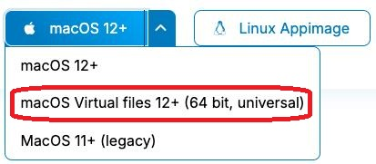

# Setting Up Local Sync

*By C.Du [@snail123815](https://github.com/snail123815) & Joost Willemse [@Karivtan](https://github.com/Karivtan)*

To access Research Drive files on your local computer, you can set up the Nextcloud desktop client to sync files between Research Drive and your local machine. This allows you to work with your data directly from your file explorer (Windows Explorer or macOS Finder).

More importantly, to **upload large files** (for example, raw data) to Research Drive, using the Nextcloud desktop client is often more reliable and efficient than uploading through the web interface. The desktop client can handle large file transfers better and can automatically retry if there are network interruptions.

With the Nextcloud desktop client, you can choose to sync specific folders or use the "virtual files" feature, which allows you to see all your files in Explorer/Finder without taking up local storage space until you open them. This is especially useful for managing large datasets without filling up your local disk.

```{contents}
---
depth: 3
---
```

## Install Nextcloud desktop client

For University Computer, please find Nextcloud desktop client in the **Company Portal** (Windows 11) or **Managed Software Centre** (macOS). For personal computer, you can download **"Nextcloud Files"** application from the [Nextcloud website](https://nextcloud.com/install/#install-clients). There is also Linux version available.

### University Mac users

I have confirmed with ISSC that the Nextcloud from **Managed Software Centre** is already "Virtual files" version. However, it is still possible that the client may not be correct after update. If that is the case, please contact the ISSC helpdesk to request an update to the Nextcloud client with "Virtual files" support. This feature is important for efficient storage management and seamless access to Research Drive files on your local machine.

(select-virtual-files-version)=
### Personal Mac users

Please make sure to select "Virtual files" desktop client to download, for example **"macOS Virtual files 12+ (64 bit, universal)"**, from the dropdown menu. The "Virtual files" version allows you to access your Research Drive files without taking up local storage space, which is inevitable for most research scenarios and is a standard practice.



## Set up Nextcloud desktop client and sync with Research Drive

- [Install the Nextcloud application](#install-nextcloud-desktop-client)
- Open Nextcloud once installed and click **Log in**  
  ```{image} ../_static/images/nextcloud_login_login.png
  :alt: login
  :width: 30em
  ```
- Enter the following URL and click **Next**  
  ```
  https://universiteitleiden.data.surf.nl
  ```
  ```{image} ../_static/images/nextcloud_login_URL.png
  :alt: Enter URL
  :width: 30em
  ```
- **Log in** with your ULCN account in the pop-up browser window
- **Grant access** when asked, then close the browser page  
  ```{image} ../_static/images/nextcloud_login_grantaccess.png
  :alt: Login and grant access
  :width: 30em
  ```
- Choose a folder to store the data; it must be a new or empty folder. **Please make sure to select a folder that is not synced by iCloud, OneDrive, or other services**. MacOS users should also avoid using the default "Documents" folder, which is often synced with iCloud and can cause issues. We recommend creating a new folder named "RD" (or similar) directly under your user directory (for example, `C:\Users\<name>\RD` on Windows or `/Users/<name>/RD` on macOS) to ensure it is not affected by other sync services and to minimize path length issues.
  - **MacOS users:**
    - You do not need to choose any file or folder to sync, the virtual file system will create a virtual drive for you, and you can access the data via the file browser. You can also choose to sync to a local folder if you prefer, but it is not required.
    - You will not see "User virtual files ..." option.
  - See [Space on your local machine: Virtual files and "Choose what to sync" are mutually exclusive](./ResearchDrive_troubleshooting.md#space-on-your-local-machine)
  ```{image} ../_static/images/nextcloud_login_chooselocation.png
  :alt: Choose sync location
  :width: 30em
  ```
- Click **Connect**. Sync should start; you can see  or <span></span> in your system tray located on the bottom right (Windows) or top right (macOS). Expand the system tray if needed.
- Check your settings:
  - Right-click the Nextcloud icon  in the system tray, then left-click "Settings"  
    ```{image} ../_static/images/nextcloud_systemtray.png
    :alt: NextCloud Settings
    ```
  - Virtual files **enabled**  
    ```{image} ../_static/images/nextcloud_login_checkvertualfileenabled.png
    :alt: Virtual files enabled in Windows 11
    :width: 45em
    ```
- For macOS users, you should see "Virtual files" is enabled by default. If not, you need to uninstall the current Nextcloud client and [download the version](#select-virtual-files-version) with "Virtual files" support. For University laptop users, please contact the ISSC helpdesk to request an update to the Nextcloud client with "Virtual files" support.
  ```{image} ../_static/images/nextcloud_enable_virtual_files_macos.jpg
  :alt: Virtual files enabled in macOS
  :width: 30em
  ```
- You can access the data via the file browser (Explorer on Windows, Finder on macOS). You should see the cloud icon on the project folder, that icon will change depending on whether the files are cloud-only or downloaded.
  ```{image} ../_static/images/nextcloud_locations.png
  :alt: Data access via file browser
  :width: 45em
  ```

::: {admonition} Create **Teams** and share within team
Sometimes you want to share a folder with all of your lab members or a specific subgroup. You can create **Teams** in the "Contacts" page (top bar), add the relevant users to that team, and then share the folder with the team instead of individual users. This way, when you add new members to the team, they will automatically have access to the shared folder.
:::

::: {admonition} Do not add data directly to the top-level Research Drive folder
Unlike OneDrive, [you do not own any space in Research Drive](./ResearchDrive.md#invite-users-and-set-up-the-folder-structure) — everything is shared with you. When you open Research Drive, the first screen you see (the **top-level folder**) only shows folders that have been shared with you:

1. The project folder that belongs to a PI
2. Any other folder shared with you

Anything you create **directly in that top-level folder** is **not part of Research Drive** and will **not be synced** — it will be lost.

```{mermaid}
graph LR
    RD["🗄️ Research Drive (top-level folder — what you see when you open Research Drive)"]
    RD --> P1["📁 ProjectA  ← shared with you ✅"]
    RD --> P2["📁 ProjectB  ← shared with you ✅"]
    RD --> BAD1["❌ 📄 my_file.txt created by yourself  ← NOT synced, will be lost!"]
    RD --> BAD2["❌ 📂 my_folder created by yourself  ← NOT synced, will be lost!"]
    RD --> GOOD1["📄 data.txt shared by others  ← synced ✅"]
    P1 --> GOOD2["📂 subfolder created by yourself inside ProjectA  ← synced ✅"]
    style BAD1 fill:#ffcccc,stroke:#cc0000
    style BAD2 fill:#ffcccc,stroke:#cc0000
    style P1 fill:#ccffcc,stroke:#009900
    style P2 fill:#ccffcc,stroke:#009900
    style GOOD1 fill:#ccffcc,stroke:#009900
    style GOOD2 fill:#ccffcc,stroke:#009900
```
:::
