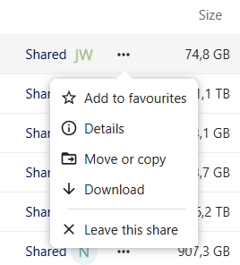

# Share folders with others

*By C.Du [@snail123815](https://github.com/snail123815) & Joost Willemse [@Karivtan](https://github.com/Karivtan)*

This page covers sharing a folder you already have edit access to: with one person, with a team,
and how to name the shared folder so the people you share it with understand what they are looking
at.

You need a folder to share first. If you do not have a project folder yet, or have not invited your
users, see [Set up and run a project folder](./ResearchDrive_admin.md).

```{contents}
---
depth: 3
---
```

## Set up share with users

The user needs to have already accepted the invitation and be able to log in to the Research Drive
web interface before you can share a folder with them. It is recommended to follow the
[intended folder structure](./ResearchDrive.md#intended-structure) and share the folders
accordingly.

Here is how to share a folder with specific users:

- Go to the **Files** tab, locate the target folder, and click the **"Shared"** button, or click
  the "..." (three dots) button and select **"Details"** from the dropdown menu.

  ```{image} ../_static/images/nextcloud_share_1.png
  :alt: share button
  :width: 30em
  ```

  - Make sure the pop-up shows the correct folder name, click "Sharing" tab if not already selected
- In **Internal shares** section, search and add the correct users (*or team name if you already
  created one*), and set permissions to allow editing (for their own folder only).

  ```{image} ../_static/images/nextcloud_share_2.png
  :alt: sharing tab
  :width: 23em
  ```

  - Remember to click **Save Share** after adding each user.

    ```{image} ../_static/images/nextcloud_share_3.png
    :alt: save share button
    :width: 15em
    ```

  - After saving, it should show the user added.

    ```{image} ../_static/images/nextcloud_share_4.png
    :alt: saved share
    :width: 15em
    ```

### Upload only folder

For folders that are meant for users to upload files but not edit or delete files, you can set the
permission to "Create" only. This way, users can only upload files to this folder, but cannot edit
or delete any files in it.

```{image} ../_static/images/nextcloud_share_5.png
:alt: advanced sharing options
:width: 15em
```

## Share with a group of users

If you want to share a folder with a group of users — all of your lab members, or a specific
subgroup — create a **Team** in the "Contacts" card, then share the folder with that team. You
then only manage the team membership, and sharing updates automatically: when you add a new member
to the team, they immediately have access to everything shared with it.

```{image} ../_static/images/nextcloud_share_6.png
:alt: Create a team in contacts
:width: 40em
```

## Name shared folders clearly

Nextcloud does not show a recipient the path above a folder you share with them. They see only the
folder's own name in their **Files** list — nothing that tells them which project, which raw data,
or which analysis it belongs to.

For example, say you share a folder called `analysis` that actually lives at
`projectA/rawdata_2024-03-15/proteomics/analysis`. You know exactly which analysis that is because
you can see the full path above it. Your collaborator only sees a folder named `analysis`. If they
work with more than one lab, or receive more than one share from you over time, they will soon have
several folders all called `analysis` with nothing to tell them apart.

::: {admonition} Rename the folder before you share it
Renaming in the **Files** tab is the fix, and doing it *before* sharing benefits everyone the
folder is shared with, now and later. If a folder was already shared under a generic name,
recipients can typically rename their own copy after accepting without changing yours — the same
kind of local, non-propagating rename that lets a
[project folder's name differ between Dashboard and Files](./ResearchDrive_admin.md#apply-for-a-project-folder) —
but that only fixes it for the one person who remembers to do it.
:::

### What to include in the name

Include enough identifiers that the folder is self-explanatory and distinguishable from every other
folder anyone else has shared with the same recipient:

- **Project or PI**: project name/code, or PI/lab initials if you share across labs.
- **Date or batch**: raw data date or batch ID, especially if you will share more analyses from the
  same project later.
- **Data type**: `proteomics`, `rnaseq`, `genomics`, etc., if the project spans more than one.
- **Content**: what the folder actually holds — `analysis`, `raw`, `results`, `QC`.

For the example above, `analysis` could become `ProjectA_2024-03-15_proteomics_analysis`, or
`2024-03-15_ProjectA_proteomics_analysis` if you want shares to sort chronologically in the
recipient's file list.

Keep it to the identifiers that actually disambiguate. This folder becomes a new sync root that
your recipient will nest further subfolders under, so an overly long name works against
[keeping paths short](./ResearchDrive_troubleshooting.md#how-to-reduce-the-risk).

### If you cannot rename the folder

Pipelines and scripts sometimes hardcode a folder name like `analysis` in relative paths, so
renaming it would break them. Share the parent folder instead (`proteomics` rather than
`proteomics/analysis`) — the recipient at least sees the data type and can browse in from there.

```{warning}
If the folder is already synced by you or your recipient through the Nextcloud desktop client,
renaming it server-side renames the local synced copy too. Settle on a name before sharing where
possible, and update any local scripts that reference the old path if you rename later.
```

## Leave a share

If a folder or file was shared with you and you no longer need it in your **Files** list, remove it
using **"Leave this share"** in the \[**&middot;&middot;&middot;**\] (three dots) menu.



This removes only *your* shortcut to it. The data itself is untouched — the owner (which may be
ISSC, for a project folder) and anyone else it is shared with keep their access, and nothing is
deleted from the cloud.

::: {admonition} The only way back is asking the owner again
:class: warning
Leaving a share is **not reversible from your side**. The only way to regain access is to ask
whoever shared it with you to share it again.

Do not rely on **Shares → Deleted shares** in the left panel to find it afterwards — a share you
left does **not** appear there.
:::
