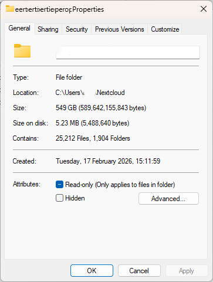
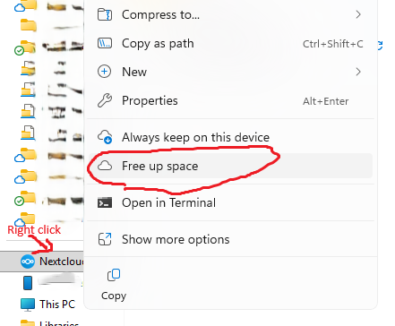

# Common issues and troubleshooting

*By C.Du [@snail123815](https://github.com/snail123815) & Joost Willemse [@Karivtan](https://github.com/Karivtan)*

Things that commonly go wrong when using Research Drive with the Nextcloud desktop client, and how
to fix them: slow or stuck syncs, local disk space, shares you cannot delete, and Windows path
length errors.

```{contents}
---
depth: 3
---
```

## Uploads through the web interface fail or time out

Web interface uploads have a **file size limit** and can **time out** for large files or a large
number of small files — and once stopped, you have to start over. Use the
[Nextcloud desktop client](./ResearchDrive_setup.md) or
[`rclone`](./ResearchDrive_commandLine.md) instead;
[Choose how to move your data](./ResearchDrive_transfer.md) explains which to pick.

External users can use both of those too: invite them, then share the folder with "Allow download
and sync" enabled (which is *not* the same as allowing "Edit"). See
[Invite users and set up the folder structure](./ResearchDrive_admin.md#invite-users-and-set-up-the-folder-structure).

## Sync taking forever

The reason for sync taking forever can be due to various factors, such as a large number of small files, limited local storage space, or issues with the Nextcloud client. If you are experiencing slow sync times, consider the following troubleshooting steps:

### Check the log

Left-click the Nextcloud icon in the system tray (the icon may change to a red cross or exclamation mark or be overlayed by them, different between versions and system), the log is shown as a list of recent events, ordered by time from newest on top. Look for any error messages or warnings that may indicate the cause of the slow sync.

### Too many small files

When you have a folder with a very large number of small files (for example, thousands or more), syncing can take a very long time. This is due to high per-file overhead: each file requires metadata operations and separate network requests. This increases CPU and disk I/O, bloats the Nextcloud client and server databases, prolongs directory scans and backups, and can cause much slower syncs, timeouts, or sync errors. Antivirus or indexing scans can further degrade performance, and some platforms may hit filesystem limits when directories contain very many entries.

Practical mitigations:

- Archive many small files into ZIP/TAR before uploading to reduce per-file overhead — see
  [Before you start a large transfer](./ResearchDrive_transfer.md#before-you-start-a-large-transfer).
- Keep frequently changing tiny files (caches, temp files) in local-only folders rather than in Research Drive.
- Avoid storing dependency/cache directories (for example `node_modules` or virtual environments) in Research Drive.

::: {admonition} This applies to other cloud storage as well
This issue is not specific to Research Drive or Nextcloud; it is a common problem with any cloud storage solution that does not handle large numbers of small files efficiently. The same advice applies to other platforms like OneDrive, Dropbox, Google Drive, etc.
:::

## Local disk space

Research Drive uses the Nextcloud desktop client to *sync* files between the **cloud** (Research
Drive) and your **local** computer. When **Virtual files** are enabled (recommended), Explorer or
Finder can show files that exist in the cloud without storing the full data locally — think of
them as placeholders that download the content only when you open it. A file can therefore count
against your Research Drive quota while taking up no space on your laptop. See
[Key concepts](./ResearchDrive.md#key-concepts) for the full explanation.

(choose-what-to-sync-are-mutually-exclusive)=
:::{admonition} Virtual files and "Choose what to sync" are mutually exclusive
The "Choose what to sync" option allows you to select specific folders to sync locally, but it is not compatible with virtual files. If you enable "Choose what to sync", you will lose the virtual file functionality, and all files in the synced folders will be downloaded to your local machine. Therefore, it is recommended to keep "Choose what to sync" disabled and use virtual files to manage your storage efficiently.
:::

### Windows "Properties" can show two different sizes

On Windows, right-click a file/folder → **Properties**. You may see:

- **Size**: the *logical* size of the file(s) (how much data it is in total).
  - Large, showing the real file size in the cloud.
- **Size on disk**: the *physical* space currently used on your local drive.
  - Zero or very small with virtual files, only metadata/placeholder data stored locally.



After you open a file (or mark it to keep offline), Windows downloads it and **Size on disk** will increase accordingly.

::: {admonition} Secure local space before opening
If you do not have enough space for the file you are opening, Nextcloud will try to reclaim space by converting downloaded local files to cloud. If it is not successful, it will report a corresponding error.
:::

### Free up space (Windows)

If your local disk is getting full, you can remove local copies while keeping the files in Research Drive.

Common options in Windows Explorer (wording may vary slightly by Nextcloud client version):

1. In the synced Research Drive folder, right-click a file or folder.
2. Choose **Free up space**.
3. Sometimes the **Free up space** option is unavailable. This usually means **the selected file or folder** is already online-only (stored only in the cloud), so there is no local copy to remove. You can check the properties to confirm.



This converts downloaded files back to online-only (virtual) files:

- The data stays in Research Drive (cloud).
- The file remains visible in Explorer.
- Disk space is freed on your computer.

## Not enough local space to upload from a network drive

Uploading normally means copying files into the synced folder first, letting Nextcloud upload
them, and then letting it replace the local copies with virtual files. If the source is a network
drive (for example `J:`) or USB storage holding more data than fits on your own disk, that first
step is the problem.

[Choose how to move your data](./ResearchDrive_transfer.md) covers the options; the usual answer is
a [temporary sync connection](./ResearchDrive_uploadFromNetworkDrive.md).

## Removing a shared folder or file

In Research Drive, you **cannot delete folders** shared with you from your computer. This can only
be done using the "Leave this share" option in the \[**&middot;&middot;&middot;**\] menu in the web
interface — see [Leave a share](./ResearchDrive_sharing.md#leave-a-share) for what that does and the
only way to get access back.

Deleting a shared **file**, on the other hand, works directly and has the same effect: it does not
delete the file from the cloud, only your share of it.

## Windows long path compatibility issue

On Windows, file paths can become too long for the operating system or for specific applications. Even on recent Windows versions, many tools still fail when the full path length approaches the legacy limit ([260 characters](https://learn.microsoft.com/en-us/windows/win32/fileio/maximum-file-path-limitation)). When this happens, files may not sync correctly and may not be usable locally.

```{warning}
If Windows cannot create a folder/file locally due to path length, the Nextcloud/Research Drive client cannot store it either. You may see sync errors.
```

### Common scenarios where files cannot be stored (or synced)

- Deep folder nesting (many subfolders), especially when the local sync folder is already long, for example:

  ```text
  C:\Users\<name>\Documents\Projects_Leiden_University\Research_abc_respond_to_xyz_rna_sequencing\20240728_experiment_with_sucrose_day_10_liquid_N2_bead_bashing
  ```

- Very long filenames, or filenames generated by software exports (for example, long sample IDs + many parameters in the name).
- Extracting archives (ZIP/TAR) into a synced folder: the extracted structure is often deeper than expected.
- Cloning software repositories into Research Drive (for example, projects containing `node_modules`, `venv`, `conda` environments, or other dependency trees).
- Workflows that auto-generate deeply nested output directories.

### How to reduce the risk

- Use a short local sync root path (for example `C:\Users\<name>\RD` or simply `C:\RD` (if you are not sharing this computer with others) instead of a long path).
- Avoid unnecessary nesting; keep project folder structures shallow.
- Shorten filenames where possible; avoid encoding too much metadata in the name. Keep the metadata in a separate file when necessary.
- **Do not store dependency folders or full software environments in Research Drive** — `node_modules`, virtual environments, conda environments. They are deeply nested, contain very many small files, and can be regenerated; keep them local.
- If you are on a managed university device and need Windows long path support enabled, contact ICT/ISSC. Enabling it typically requires admin rights, and note some applications still ignore the setting or report error while reading those files.

## File names Windows cannot store

Research Drive does not restrict file names, but Windows does. A name containing any of these
characters cannot exist on a Windows machine:

```text
\  /  :  *  ?  "  <  >  |
```

The same applies to names ending in a dot or a space, and to the reserved names `CON`, `PRN`,
`AUX`, `NUL`, `COM1`–`COM9` and `LPT1`–`LPT9` — including with an extension, so `AUX.txt` fails
too.

Because the server accepts them, such files are created routinely: on the IBL servers or any other
Linux machine, on macOS, or through the web interface. A colon is the usual offender — it is
perfectly ordinary on Linux and frequently ends up in timestamps and sample names. Nothing goes
wrong until a Windows user syncs that folder, at which point Windows cannot write the file.

Rename the file, either in the web interface or on the machine where it was created, and the sync
completes.
