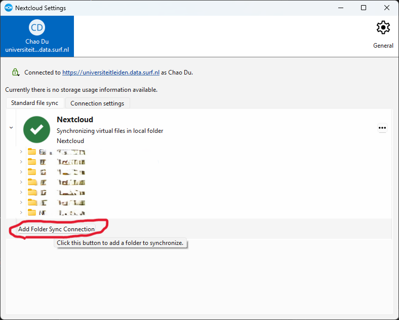
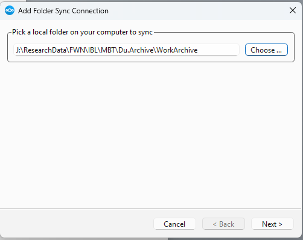
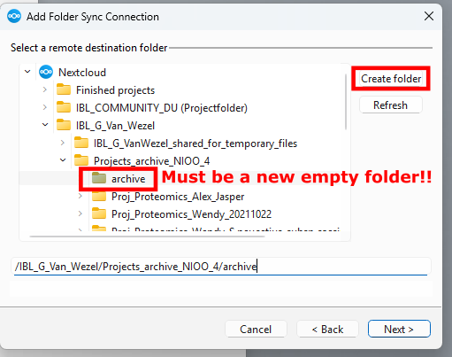
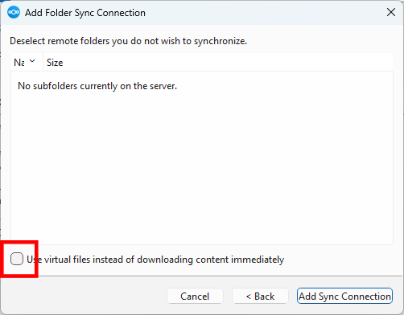
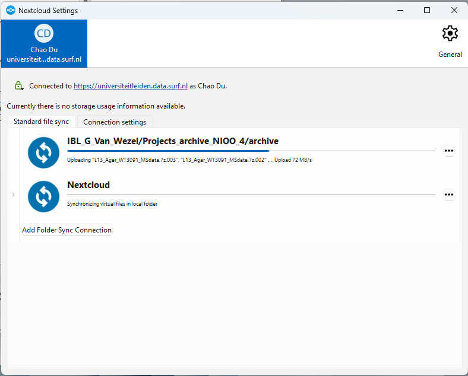
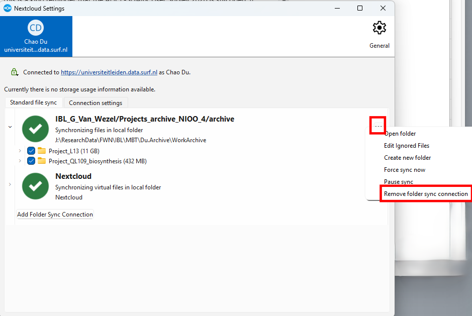
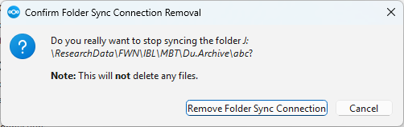

# Transfer to ResearchDrive from Mapped Network Drive

Uploading files usually involves three steps:

1. Copy/move local files into the synced folder.
2. Nextcloud uploads these files to ResearchDrive (or other cloud storage).
3. If the files are not used, or if local storage is full, Nextcloud removes the local copies and replaces them with “virtual files”.

If you have large files located on your network drive, the first step can be difficult because you may not have enough local storage to hold them temporarily.

## Check capacity and reduce the number of small files

Make sure you have enough capacity. If needed, request more from the ISSC helpdesk using the correct cost centre.

If you have many small files, we recommend creating zip files before uploading. Large numbers of small files are expensive to store and transfer compared to fewer large files. For easier searching, you can keep a separate copy of human-readable results outside the zip archives.

:::{admonition} Sizes are not accurate
Due to differences between file systems, the sizes on your own system may not match the sizes shown on ResearchDrive.
:::

### On ResearchDrive

500 GB = 465.66 GiB

- Size units on "Files" page is TiB/GiB/MiB
- Size units on "Dashboard" page is TB/GB

Check the capacity of your target ResearchDrive project folder. Note that capacity may be calculated differently depending on the page, and that dashboard updates can be delayed after you upload or delete files.

### On your network drive

Right-click your source folder to see its size in the “properties” window. If it takes too long, consider using [WinDirStat](https://windirstat.net/) (download “Zipped Executables” on your university computer).

## Upload and remove sync after

1. Open settings: right-click  and click “Settings”.
2. Click “Add Folder Sync Connection”, then pick the source directory you want to upload.
   
   
3. Click “Next”, choose a target location, click **“Create folder”**, then click “Next”.
   
4. Uncheck “Use virtual files instead ...”, then click “Add Sync Connection”.
   
5. The upload starts; wait for it to finish. Try not to change anything in the source folder while uploading.
   
6. Once the upload has finished, confirm everything is green, then check your files in the web interface or in your default sync folder.
7. Remove the additional sync folder by clicking “Remove Folder Sync Connection”, and confirm the removal.
   
   
8. You can now safely remove your data from your network drive.

:::{admonition} Always sync to empty folder
A sync folder is always synced bidirectionally, so using an empty folder helps ensure Nextcloud does not download data back to your network drive.
:::

## In case of upload errors

If you see red crosses or yellow warnings, left-click the  icon and scroll to the top to see what is happening. If you are not sure, please contact the IBL RDM team with a screenshot and any related information.