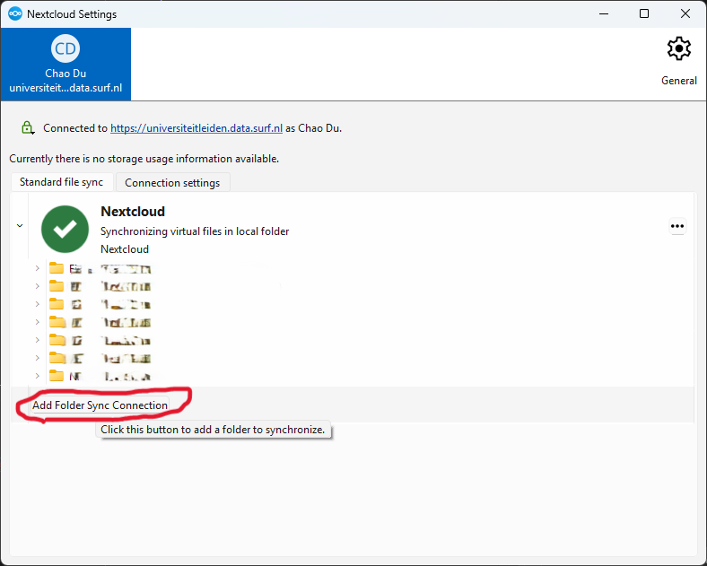
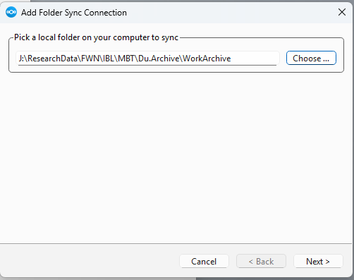
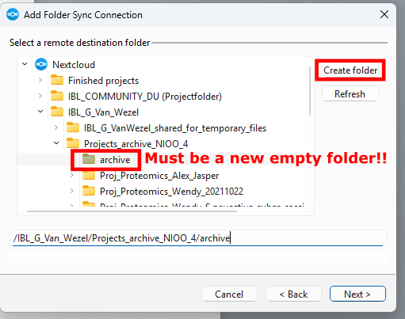
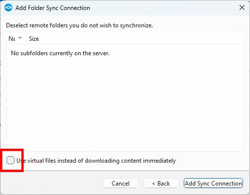
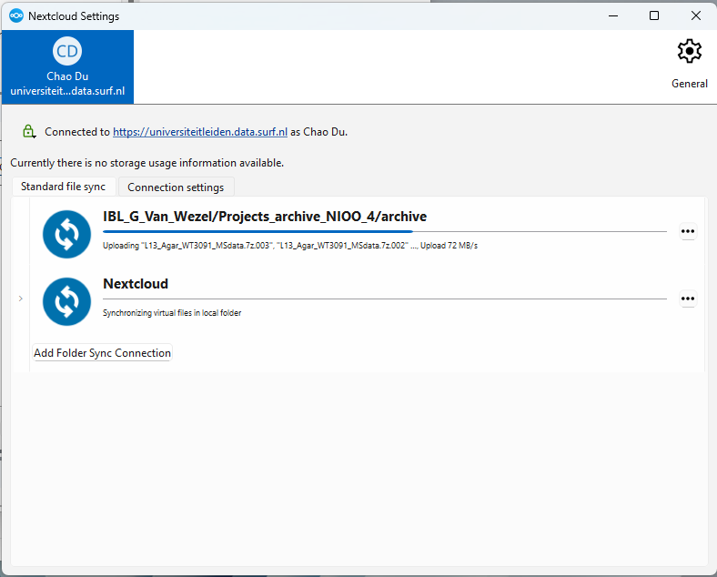
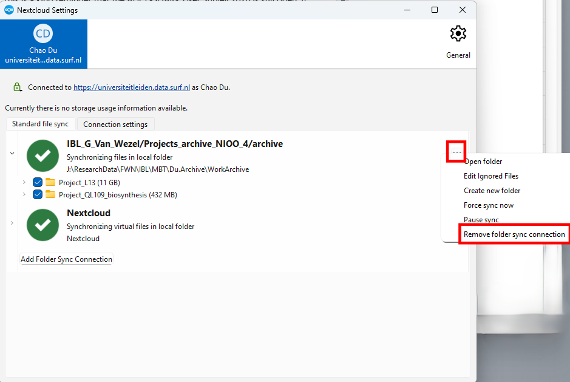
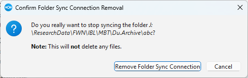

# Upload Data to ResearchDrive from Mapped Drives and USB Storage

*By C.Du [@snail123815](https://github.com/snail123815)*

If you have large files located on a **mapped network drive (e.g., `J:`)** or **USB storage device**, you may encounter difficulties when trying to upload them to Research Drive using the web interface or the Nextcloud desktop client. This guide provides step-by-step instructions on how to upload large files from mapped drives or USB storage to Research Drive using the Nextcloud desktop client, as well as troubleshooting tips for common issues that may arise during the upload process.

:::{admonition} Problems using web interface or Nextcloud desktop client directly
Web interface uploads usually have a file size limit and can time out for large files. It also depends on the stability of your internet connection and the stability of your other opened tabs, which can be problematic for large transfers. Once stopped, you may have to start over from the beginning.

The Nextcloud desktop client typically requires you to copy files into a synced folder on your local machine before uploading, which can be an issue if you do not have enough local storage space to hold the files temporarily.
:::

```{contents}
---
depth: 3
---
```

## Check capacity and reduce the number of small files

Make sure you have enough capacity. [Request more if needed](./ResearchDrive.md#expand-storage-space).

Note that [there are differences in file size calculation regarding with your quota](./ResearchDrive.md#different-sizes-in-dashboard-and-files).

If you have many small files, we recommend creating zip files before uploading. Large numbers of small files are expensive to store and transfer compared to fewer large files. For easier searching, you can keep a separate copy of human-readable results outside the zip archives.

:::{admonition} Sizes are also not accurate between local and remote
Due to differences between file systems, the sizes on your own system may not match the sizes shown on ResearchDrive.
:::

### On your mapped drive or USB storage

Right-click your source folder to see its size in the “properties” window. If it takes too long, consider using [WinDirStat](https://windirstat.net/) (download “Zipped Executables” on your university computer).

## Upload and remove sync after

1. Open settings: right-click  and click “Settings”.
2. Click “Add Folder Sync Connection”, then pick the source directory you want to upload.
   
   
3. Click “Next”, choose a target location, click **“Create folder”**, then click “Next”.
   
4. Uncheck “Use virtual files instead ...”, then click “Add Sync Connection”.
   
5. The upload starts; wait for it to finish. Try not to change anything in the source folder on the mapped drive or USB storage while uploading.
   
6. Once the upload has finished, confirm everything is green, then check your files in the web interface or in your default sync folder.
7. Remove the additional sync folder by clicking “Remove Folder Sync Connection”, and confirm the removal.
   
   
8. You can now safely remove your data from your mapped drive or USB storage.

:::{admonition} Always sync to empty folder
A sync folder is always synced bidirectionally, so using an empty folder helps ensure Nextcloud does not download data back to your mapped drive or USB storage.
:::

## In case of upload errors

If you see red crosses or yellow warnings, left-click the  icon and scroll to the top to see what is happening. If you are not sure, please contact the IBL RDM team with a screenshot and any related information.