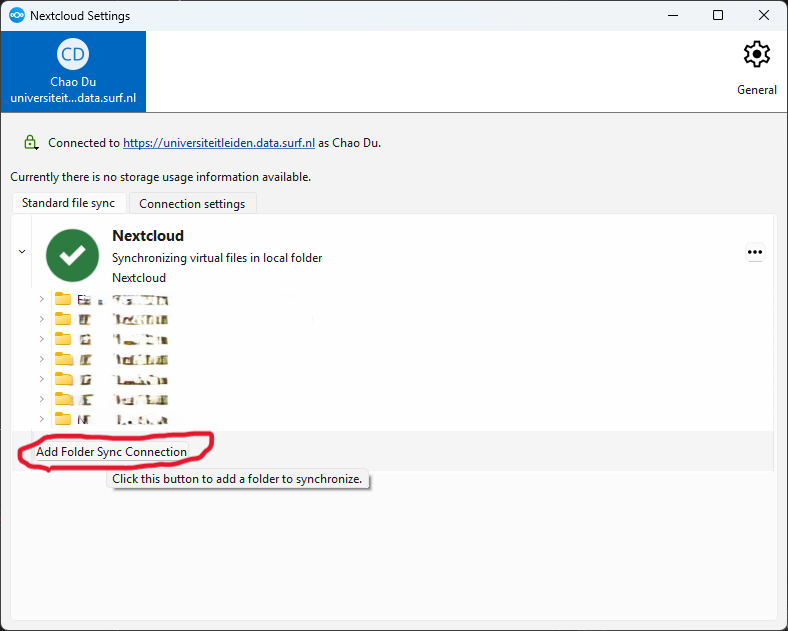
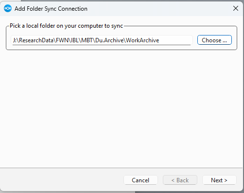
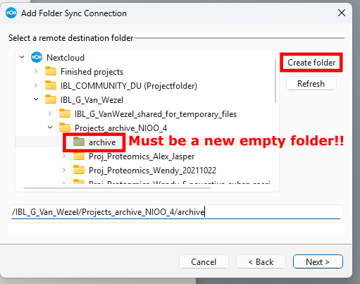
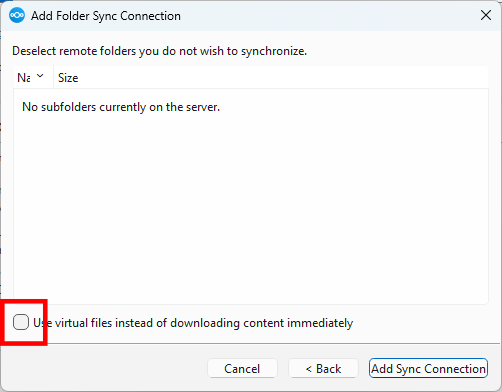
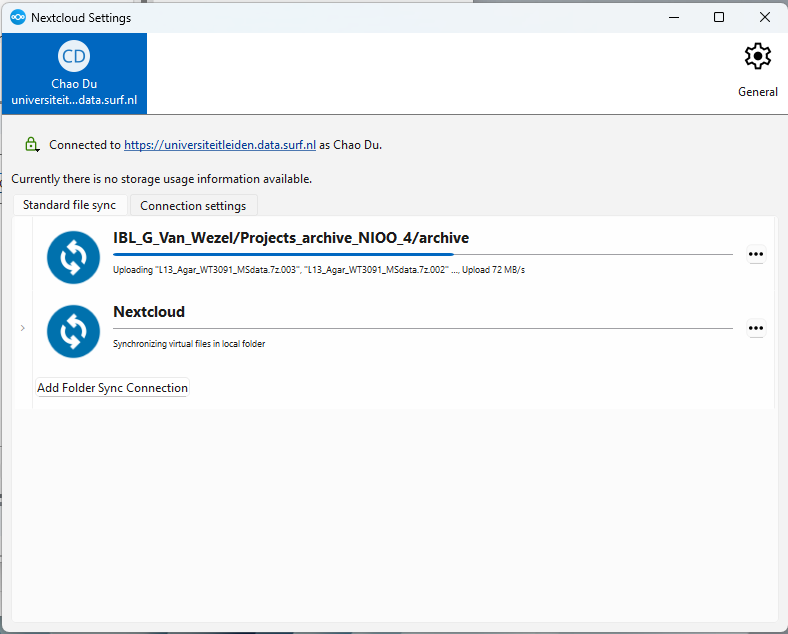
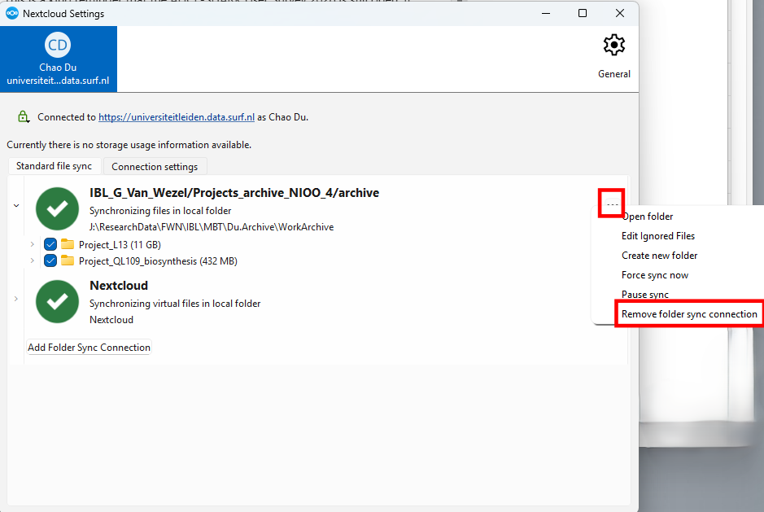
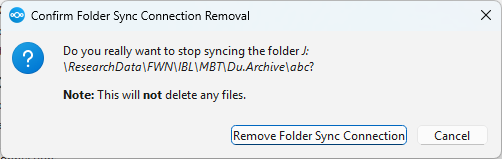

# Upload from a network drive or USB

*By C.Du [@snail123815](https://github.com/snail123815)*

Large data often sits on a **mapped network drive (e.g., `J:`)** or **USB storage**, and is too big
to copy onto your local disk first. This page shows how to upload it with the **Nextcloud desktop
client** by setting up a **temporary sync connection** directly against the source, so the data
never has to fit on your own machine.

- Not sure this is the right method? See
  [Choose how to move your data](./ResearchDrive_transfer.md).
- Don't have the client yet? Install and configure it first:
  [Set up sync on your computer](./ResearchDrive_setup.md).
- On a Linux server, on ALICE, or unable to install the client? Use
  [`rclone` on the command line](./ResearchDrive_commandLine.md) instead.

```{contents}
---
depth: 3
---
```

## Before you start

**Check you have the capacity.** [Request more if needed](./ResearchDrive_admin.md#expand-storage-space),
and note that the sizes shown in Research Drive are not always in the units you expect — see
[Storage space and quota](./ResearchDrive.md#storage-space-and-quota).

**Zip up large numbers of small files** before uploading; they are far slower to transfer than a
few large ones. For easier searching, keep a separate copy of human-readable results outside the
zip archives. More detail in
[Before you start a large transfer](./ResearchDrive_transfer.md#before-you-start-a-large-transfer).

### Check the size on your mapped drive or USB storage

Right-click your source folder to see its size in the "properties" window. If it takes too long, consider using [WinDirStat](https://windirstat.net/) (download "Zipped Executables" on your university computer).

## Upload and remove sync after

1. Open settings: right-click <span></span> or <span></span> or <span></span> and click "Settings".
2. Click "Add Folder Sync Connection", then pick the source directory you want to upload.
   
   
3. Click "Next", choose a target location, click **"Create folder"**, then click "Next".
   
4. Uncheck "Use virtual files instead ...", then click "Add Sync Connection".
   
5. The upload starts; wait for it to finish. Try not to change anything in the source folder on the mapped drive or USB storage while uploading.
   
6. Once the upload has finished, confirm everything is green, then check your files in the web interface or in your default sync folder.
7. Remove the additional sync folder by clicking "Remove Folder Sync Connection", and confirm the removal.
   
   
8. You can now safely remove your data from your mapped drive or USB storage.

:::{admonition} Always sync to empty folder
A sync folder is always synced bidirectionally, so using an empty folder helps ensure Nextcloud does not download data back to your mapped drive or USB storage.
:::

## In case of upload errors

If you see red crosses or yellow warnings, left-click the <span></span> or <span></span> or <span></span> icon and scroll to the top to see what is happening. [Common issues and troubleshooting](./ResearchDrive_troubleshooting.md) covers the usual causes. If you are not sure, please contact the IBL RDM team with a screenshot and any related information.
