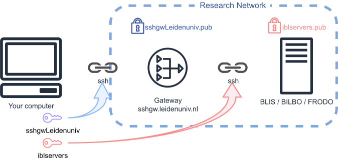

# Command line setup

*By C.Du [@snail123815](https://github.com/snail123815), Edder Bustos Diaz [@EdderDaniel](https://github.com/EdderDaniel)*

```{contents}
---
depth: 3
---
```

## Start a CLI

### Terminology

- **CLI**, short for <u>c</u>ommand <u>l</u>ine <u>i</u>nterface, is text based interface for interacting with an operating system. It is more efficient than graphical interface when you know what to do.
- **Shell** is the program that implements CLI. bash, zsh, powershell (ps) are shells.
- **Terminal** (emulator) is an application that helps you communicate with a **shell**. Windows Terminal, Terminal, 
- **OS**, short for operating system. There are 3 main classes you can encounter: MacOS (Apple operating system), Windows, Linux

### Start from different OS

Here's how to start a shell program on different operating systems:

- For MacOS users, open the "Terminal" application by typing "Terminal" in *spotlight*. Default shell is zsh.
- For Linux users, open the "Terminal" application (sometimes it is directly called "shell"). Default shell is bash.
- For Windows users, there are several options to be in a pure CLI environment:
  - [MobaXterm](./ssh%20access%20mobaxterm.md) is recommended on University computers. Please follow the link to download the program and then proceed to [start MobaXterm](./ssh%20access%20mobaxterm.md#start-mobaxterm), then come back to this page to follow the tutorial.
  - [**Git for windows**](https://gitforwindows.org) provides "GitBash" program that comes with a <u>shell</u> environment similar to Linux systems, and the settings will also be the same as Linux. The "GitBash" program can be executed without installation.
  - [**Windows Terminal**](https://apps.microsoft.com/detail/9n0dx20hk701?hl=en-US&gl=US) app. Can be installed on University computers (you might need to login to your personal Microsoft account). It is a focused terminal emulator, able to host Windows PowerShell which includes SSH program.
    - **Windows PowerShell**, default app in windows, version 5 comes with its own terminal emulator. Highly recommand you to install an additional latest version of PowerShell [from "Microsoft Store"](https://learn.microsoft.com/en-us/powershell/scripting/install/install-powershell-on-windows?view=powershell-7.5#install-from-the-microsoft-store). Remember when you run PowerShell, you are running its default terminal emulator, it can also host WSL using `wsl` command to be a **pure Linux environment**. No matter which version of PowerShell you use, the **OpenSSH** program that provides `ssh` command. Since Linux and Windows have slightly different understanding of `$HOME` folder, setting up SSH connection in PowerShell is a bit different. Prepare to spend a bit more time on it.
    - Windows Subsystem for Linux (WSL) shells - Only on personal PC, requires WSL installation. These shells are best supported in **Windows Terminal**. You can find more detailed instructions on how to install and start it [here](https://learn.microsoft.com/en-us/windows/wsl/install). Once you have WSL setup correctly, you will have access to a **pure Linux <u>shell</u> environment**.

### How to copy/paste in terminals

Copy/paste in terminals differs from regular apps. Common `Ctrl+C` and `Ctrl+V` may not work; `Ctrl+C` often sends an interrupt to the running program instead of copying.

- **Linux (GNOME Terminal, Konsole, xterm):** Use `Ctrl+Shift+C` to copy and `Ctrl+Shift+V` to paste. On many Linux desktops, you can also paste with the middle mouse button. `Shift+Insert` often pastes too.
- **macOS (Terminal, iTerm2):** Use `Cmd+C` to copy and `Cmd+V` to paste. Right‑click shows a menu for Copy/Paste.
- **Windows Terminal / PowerShell:** Recent versions support `Ctrl+C` (copy selection) and `Ctrl+V` (paste). If a command is executing, `Ctrl+C` interrupts it. Right‑click usually opens a context menu with Copy/Paste; in some setups, right‑click directly do copy (if some text is selected) or paste (no selection).
- **Git Bash / MobaXterm:** Git Bash typically uses `Ctrl+Insert` (copy) and `Shift+Insert` (paste) or `Ctrl+Shift+C/V`. MobaXterm supports right‑click paste and a context menu for copy/paste.

Tips:
- Select text first; many terminals only copy selected text.
- Prefer keyboard shortcuts over `Ctrl+C` while a command is running to avoid interrupting it.
- Be careful with trailing spaces/newlines when pasting long commands.
- If shortcuts fail, try right‑click → Copy/Paste or check terminal settings.

When you copy and paste commands, it ensures accuracy, especially for long commands. Typing manually helps you learn syntax. Always read the command before pressing ENTER.

```{admonition} Do not copy directly
:class: warning
**DOUBLE CHECK COMMANDS BEFORE EXECUTING THEM**

Please note this tutorial do not know the IP address you are connecting to, your `USERNAME`, nor your `ULCN`. Please carefully check the commands you copy and adjust them accordingly.r

Be careful about **cases** and **spaces**. Especially, do not miss a **space**! They have special meanings for comands and are very important!

Some commands are quite long, please use the scroll bar underneath.

In CLI, you cannnot use your mouse. To edit the command easily, you can use a simple text editor, for example Notepad (windows), Nano (Linux), and TextEdit (MacOS), copy and edit your command there.
```

## SSH through SSH gateway

As explained before, all connections except those made on university desktops need to pass through a gateway server to protect our intranet. We recommend you use [Leiden University general purpose gateway](../IBL_servers/Intro.md#leiden-university-general-purpose-gateway). Using ALICE gateway is **not** recommended. If you use, you need to use ALICE gateway URL and your ALICE account for the gateway. !!Use ALICE gateway at your own risk!!

URL of general purpose gateway is `sshgw.leidenuniv.nl`. Once you are able to log in to the gateway following [this tutorial (login needed)](https://helpdesk.universiteitleiden.nl/tas/public/ssp/content/detail/knowledgeitem?unid=4b176453-ad3f-418f-9c15-40a11471de5f), you can proceed with the following setups. It's perfectly safe to access the servers through the gateway, even if you're already within Research Network.

GOAL: Once you've completed this setup, you can access our servers (e.g., BLIS) from your computer with a single command: `ssh blis`, `ssh frodo`, or `ssh bilbo`.

(ssh-cli-setup)=
## Setup

CLI on all system shares the same commands except in PowerShell on Windows systems. The major difference is how to represent a file or directory (folder) path.

```{admonition} Representation of Path
<u>Windows systems</u> uses "`DriveLetter:\path\to\your\file`", for example `"C:\Users\Public\Documents\"`. This is the same for Microsoft programs including CMD and PowerShell. The path starts with a drive letter followed by a colon "`C:`" to indicate which drive it belongs, then uses "**backslash**", "`\`", to separate directory hierarchy.

<u>Linux/MacOS/GitBash</u> however, only uses "**forwardslash**", "`/`", to separate directory hierarchy. The **full path** always starts from the "**root**" directory represented by a single "`/`". For example, the <u>GitBash representation</u> of the above mentioned directory will be "`/c/Users/Public/Documents/`", it is because GitBash convert Windows paths to "linux like". In <u>WSL</u>, Windows file systems will be **mounted** at location "`/mnt/`", thus the above path is then "`/mnt/c/Users/Public/Documents/`".

Note:
1. A standing pipe "`|`" that will fall forward (right side) "`/`" is a "forwardslash"
2. Only Windows system do not care letter cases. Thus, it is good practice to always use correct cases for commands and paths.

**Home directory** is where your user files located. In Linux, it is usually "`/home/[username]`". It can be safely represented by a telda mark "`~`" in Linux. So, in Linux, "`~`" = "`/home/[username]`". In Windows, the home directory is "`C:\Users\[UserName]`", it sometimes can also be replaced by a telda mark in some latest version of PowerShell. However, telda mark "`~`" cannot be reliablly parsed in PowerShell, in most cases, replacing it with a more complex "`$HOME`" or even "`$env:HOME`" is needed.
```

There are four steps:

1. [Creeate ssh key pair](#1-create-ssh-key-pair)
2. [Let server recognise your key](#2-let-server-recognise-your-key)
3. [Configure local machine to use a correct key](#3-configure-local-machine-to-use-a-correct-key)
4. [Connect](#4-connect)

(create-ssh-key-pair)=
### 1. Create ssh key pair

In your terminal do:

```shell
# Create a directory/folder called ".ssh"
mkdir -p ~/.ssh
# For PowerShell users, you may need to
# replace ~ with $HOME or $env:HOME,
# follow this rule in all following commands. For example
mkdir -p $HOME/.ssh

# Generate a key pair:
ssh-keygen -t ed25519 -C "From my PC" -f ~/.ssh/iblservers
```

When you execute this command, you'll be prompted to enter a "passphrase". You can simply press ENTER to proceed. Otherwise this passphrase will be asked every time you use this key, (too) much  safer.

You should see some output looks like this:

```text
Generating public/private ed25519 key pair.
Enter passphrase (empty for no passphrase):
Enter same passphrase again:
Your identification has been saved in iblservers
Your public key has been saved in iblservers.pub
The key fingerprint is:
SHA256:M2238Cx5UCQgGivrRI5gtay92U3QULSQtTneghU2kO8 From my PC
The key's randomart image is:
+--[ED25519 256]--+
|   ..+OB... .    |
|  o .*=.*  o     |
|..ooo..B    .    |
|o+oo  =.o. .     |
|..+. ..+S.= .    |
| o  + oE.+ B .   |
|  .o . .  o =    |
|           o     |
|                 |
+----[SHA256]-----+
```

By running this command, you have actually created a pair of files that we refer to as a "key pair":

```sh
~/.ssh/iblservers
~/.ssh/iblservers.pub
# If you are using PowerShell, remember these are in
C:\Users\[UserName]\.ssh\
```


The file `iblservers` is your private key. Be sure not to share its contents with anyone;
The `iblservers.pub` file is your public key, which you will add to the `authorized_keys` file of all servers using the `ssh-copy-id` command.

You can use the same key pair to access all servers. However, it's safer to create a separate key pair for accessing the gateway. We highly recommend following this practice, and the rest of this tutorial will assume that you have created a separate key pair for accessing the gateway:

```shell
# For PowerShell users, please remember to
# replace ~ with $HOME or $env:HOME, I will not remind you again ;-)
ssh-keygen -t ed25519 -C "From my PC" -f ~/.ssh/sshgwLeidenuniv
```

(let-server-recognise-your-key)=
### 2. Let server recognise your key

However, you also need to inform the servers that these keys belong to you and that you should be allowed to use them when logging in. To be sure that is you that is adding these keys, you are going to use your username and password to login. This process is different for PowerShell on Windows compared to MacOS / Linux / GitBash / Cygwin. Please refer to the correct section for your setup.

:::{warning}
Gateway servers are strict. To avoid being blocked:

1. Use your ULCN username and ULCN password.
2. Password input is invisible (no asterisks). Check Caps Lock and type carefully.
3. Multiple failed logins will block your account or IP for ~30 minutes; repeated failures may require ISSC to unblock you.
4. Changes (like adding keys) can take a few minutes to propagate. Be patient before retrying key-based login.
:::

:::{note}
Be extremely careful with the passwords you use.

- For the <u>gateway</u> connection, enter your **ULCN password** when the prompt says 

  ```text
  ULCN@sshgw.leidenuniv.nl's password:
  ```

- For the <u>IBL servers</u> connection, enter the **password you received** via email when the prompt says

  ```text
  USERNAME@999.999.999.999's password:
  ```

  If it is the first time login, you will receive `Password expired. Change your password now.` notification. Enter your given password again, followed by your new password twice. Your old password will be deactivated once succeed.
:::

#### 2.1 On Windows using PowerShell

As the `ssh-copy-id` program is not available in Windows PowerShell, an alternative method is required to configure the server to recognize the generated keys.

Compose the following one line command with your ULCN username:

```PowerShell
# Scroll to the right for full command
type $env:USERPROFILE\.ssh\sshgwLeidenuniv.pub | ssh ULCN@sshgw.leidenuniv.nl "cat >> .ssh/authorized_keys"
```

Type your **ULCN** password to complete the operation. Now you have copied the corresponding public key `sshgwLeidenuniv.pub` to our university Gateway server. **Note** here in PowerShell, `$env:USERPROFILE` is a replacement of `~` for the "HOME" directory.

Now copy the corresponding public key `iblservers.pub` to our IBL servers using the following command. Do change the IP address 999.999.999.999 to the IP of BLIS, you can run the same command multiple times using IP address of other servers:

```PowerShell
# Scroll to the right for full command
type $env:USERPROFILE\.ssh\iblservers.pub | ssh USERNAME@999.999.999.999 "mkdir -p .ssh && cat >> .ssh/authorized_keys"
```

#### 2.2 On MacOS, Linux, GitBash, Cygwin

`ssh-copy-id` program exists on these systems. The command to add the `sshgwLeidenuniv` key pair to the Gateway and upload the corresponding public key file is:

```shell
ssh-copy-id -i ~/.ssh/sshgwLeidenuniv.pub ULCN@sshgw.leidenuniv.nl
```

Remember to replace `ULCN` with your actual ULCN username in the command. After running the command, you will be prompted to enter your ULCN password. When succeeded, you should see output containing:

```text
...
Number of key(s) added: 1

Now try logging into the machine, with:   "ssh 'ULCN@sshgw.leidenuniv.nl'"
and check to make sure that only the key(s) you wanted were added.
```

Do not try it just yet (or if you tried, remember to `exit` back to your local machine). Now, from your local machine, add `iblservers.pub` key to BLIS. Do change the IP address 999.999.999.999 to the IP of BLIS, you can run the same command multiple times using IP address of other servers:

```shell
ssh-copy-id -i .ssh/iblservers.pub -o ProxyJump=ULCN@sshgw.leidenuniv.nl USERNAME@999.999.999.999
```

Remember to replace `ULCN` with your ULCN username, `USERNAME` with the username provided in the email, and `999.999.999.999` with the actual IP address provided in the email. Pay attention to which password it asks for. After your password is accepted, the command should finish with output containing:

```text
...
Number of key(s) added: 1

Now try logging into the machine, with:   "ssh -o 'ProxyJump=ULCN@sshgw.leidenuniv.nl' 'USERNAME@999.999.999.999'"
and check to make sure that only the key(s) you wanted were added.
```

You can try it by following the instructions, but now you should be able to connect from your local machine using a easier command.

(configure-local-machine-to-use-a-correct-key)=
### 3. Configure local machine to use a correct key

After above steps, you still cannot access the gateway and our servers with the ssh keys, ie, you still need to use your password every time you connect. To make our efforts yield valuable results, ou need to add the correct configuration to your `~/.ssh/config` file on your local machine. This is the configuration file for `ssh` program to know which key to use when connecting to a specific server.

You must noticed that in previous steps, we generated two key pairs for "gateway" and "IBL servers" (BLIS, FRODO, BILBO). This is explained in [SSH gateway](./ssh%20access.md#ssh-gateway)



Change and execute the multiple lines command below. 

#### 3.1 On Windows using PowerShell

```{code-block} PowerShell
---
emphasize-lines: 3, 7, 8, 9
caption: Do not forget to change USERNAME and IP address
---
"
Host sshgw.leidenuniv.nl
    User ULCN
    HostName sshgw.leidenuniv.nl
    IdentityFile $HOME/.ssh/sshgwLeidenuniv

Host blis
    User USERNAME
    HostName 999.999.999.999
    # Use BLIS IP address in the above line
    ProxyCommand ssh -A sshgw.leidenuniv.nl -p 22 -q -W %h:%p
    IdentityFile $HOME/.ssh/iblservers
    ServerAliveInterval 60
    ServerAliveCountMax 10
" | Set-Content -Path $HOME/.ssh/config -Encoding UTF8 -NoNewline
```

If you also want to directly connect to another server, open the `C:\Users\[UserName]\.ssh\config` file in a text editor and add repeated content of the last section (start with the line "Host ...") and change the information of the other server. Make sure after you save the file, it does not have any file extension, `config.txt` will not work. Check Google for how to show all file extensions in Explorer. `.ssh/` directory is sometimes hidden. To find it, configure your file explorer to show hidden files.

#### 3.2 On MacOS, Linux, GitBash, Cygwin

```{code-block} shell
---
emphasize-lines: 3, 7, 8, 9
caption: Do not forget to change USERNAME and IP address
---
echo "
Host sshgw.leidenuniv.nl
    User ULCN
    HostName sshgw.leidenuniv.nl
    IdentityFile ~/.ssh/sshgwLeidenuniv

Host blis
    User USERNAME
    HostName 999.999.999.999
    # Use BLIS IP address in the above line
    ProxyCommand ssh -A sshgw.leidenuniv.nl -p 22 -q -W %h:%p
    IdentityFile ~/.ssh/iblservers
    ServerAliveInterval 60
    ServerAliveCountMax 10

" >> ~/.ssh/config
```

```{note}
Please note that the command above appends text to the config file. **Do not run it again** if you need to make changes to the configuration. Instead, open the file directly using a text editor to change.
```

If you also want to directly connect to another server, open the `~/.ssh/config` file in a text editor and add repeated content of the last section (start with the line "Host ...") and change the information of the other server. `.ssh/` directory is always hidden. To find it, configure your file explorer to show hidden files.

(connect)=
### 4. Connect

You have successfully generated and stored the keys on your local computer. You have also configured your computer to use these keys when connecting to the gateway and the BLIS server. Now you should be able to login BLIS with one command from your local machine:

```sh
ssh blis
```

This command will use the configuration you added to your `.ssh/config` file for the `Host blis` section to connect to the BLIS server. It will connect with your provided `USERNAME` and to the specific host, which in our case is provided as an IP address.

Once inside BLIS, you can directly connect to another servers using `ssh` command plus lower case server name.

(ALICE uses the same setup, please refer to [How to login to ALICE or SHARK - HPC wiki](https://pubappslu.atlassian.net/wiki/spaces/HPCWIKI/pages/37748771/How+to+login+to+ALICE+or+SHARK).)

:::{note}
Before you run any programs, you have to understand that we use "environments" to manage softwares on all systems. On BLIS, we use `micromamba`, a `conda` replacement, for environment management, [check it out](../IBL_servers/Execute%20programs.md).
:::

(make-direct-SSH-connection)=
## Make direct SSH connection (University Desktop with PowerShell)

If you have a university desktop computer that is located inside an university building, you are naturally inside the Research Network. It is recommended to setup using [MobaXterm](./ssh%20access%20mobaxterm.md#). If you insist, please go on reading.

**PowerShell** comes by default with Windows. The default version comes with the software called "openSSH", providing command line program `ssh`.

We do not recommend setting up connection using PowerShell. Although you do not need to download any 3<sup>rd</sup> party application, it may cause unforeseen problems and you may need to spend more time on it. With that said, if you know what you understand provided commands, it is pretty simple.

You only need to create `iblservers`, `iblservers.pub` key pair as indicated in and copy `iblservers.pub` directly to our server. The `config` file in `C:\Users\[UserName]\.ssh\` directory can also be simplified.

```{code-block} PowerShell
---
emphasize-lines: 7, 8, 9, 19
caption: Do not forget to change USERNAME and IP address
---
# Create ssh key pair
mkdir -p $env:HOME/.ssh
ssh-keygen -t ed25519 -C "From my PC" -f $env:HOME/.ssh/iblservers

# Confige your local machine to use the keys
"
Host blis
    User USERNAME
    HostName 999.999.999.999
    # Use BLIS IP address in the above line
    IdentityFile $HOME/.ssh/iblservers
    ServerAliveInterval 60
    ServerAliveCountMax 10
" | Set-Content -Path $HOME/.ssh/config -Encoding UTF8 -NoNewline

# Add keys to the server, scroll to the right for full command
type $env:USERPROFILE\.ssh\iblservers.pub | ssh USERNAME@999.999.999.999 "mkdir -p .ssh && cat >> .ssh/authorized_keys"

# Connect
ssh blis
```

If you also want to directly connect to another server, open the `C:\Users\[UserName]\.ssh\config` file in a text editor and add repeated content of the last section (start with the line "Host ...") and change the information of the other server. Make sure after you save the file, it does not have any file extension, `config.txt` **will not work**. Ask a search engine how to show all file extensions in File Explorer. `C:\Users\[UserName]\.ssh\` directory is sometimes hidden. To find it, configure your file explorer to show hidden files or directly enter the directory path in the address bar of File Explorer.

## No Guarantee

There is no guarantee that the procedure will be completely the same on your machine, if you find it strange, please read the screen and you should be able to sort out. If not, please make screen shots and create a "New issue" ([@snail123815](https://github.com/snail123815/IBL-bioinformatics-wiki/issues)) (or send me an email (c.du\[at\]biology.leidenuniv.nl) with your screen shots and detailed information).