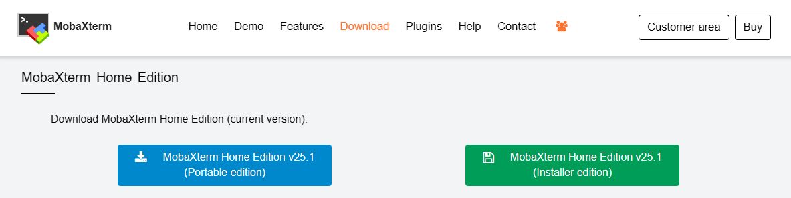
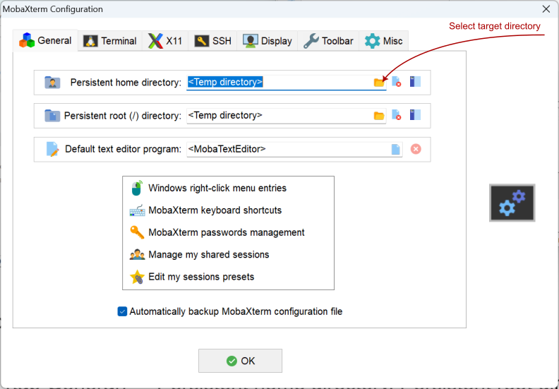
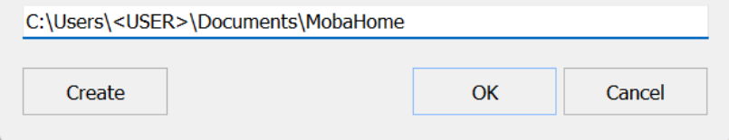
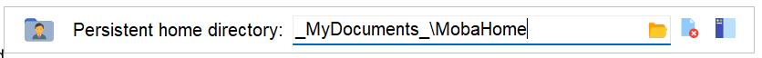
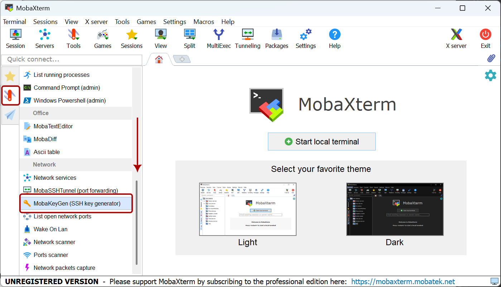
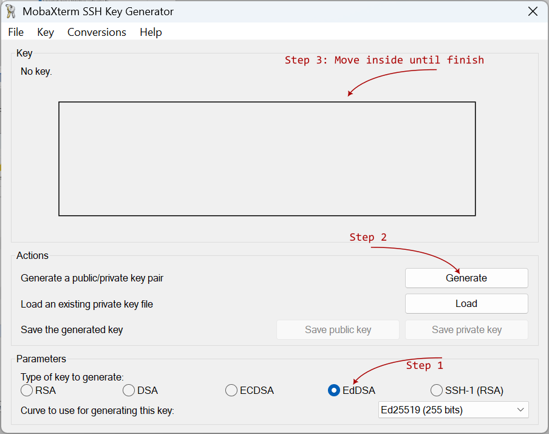
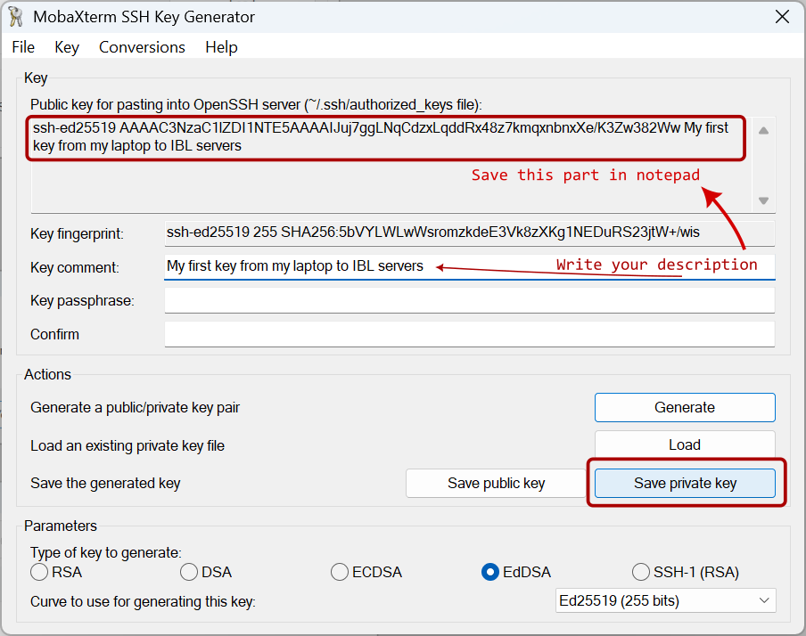
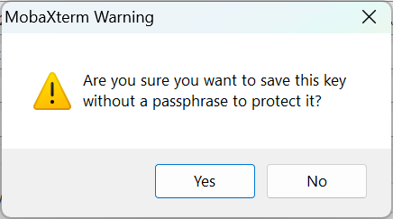
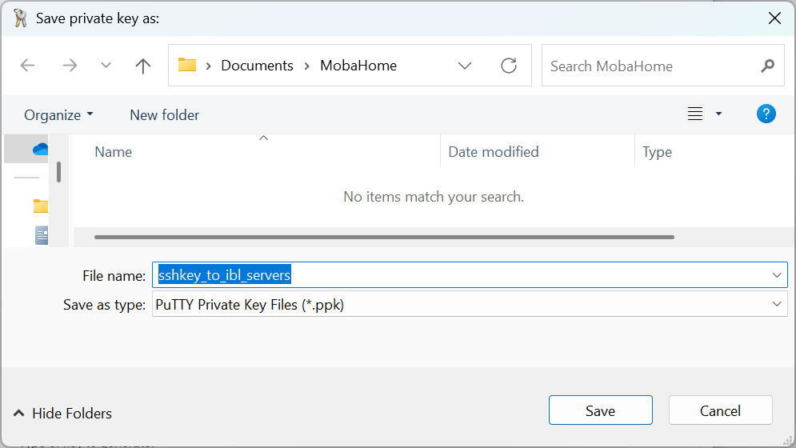

# MobaXterm setup

MobaXterm is a 3rd party terminal application for Windows. The program has a dedicated part of dealing SSH connections, which is quite user friendly. Additionally, it comes with **X11 server**, which allows you to run some GUI applications on the remoter server, while show the interface locally. For example, you can run python or R plotting scripts and show the plots locally. While in a pure SSH connection, you can only save the plot to images (PNG or JPEG) and then transfer them back to your local computer to view the result.

You can download MobaXterm home edition from [this link](https://mobaxterm.mobatek.net/download-home-edition.html). For university computers, please download the "Portable edition" on the left; for your own computer, both are fine.

## Portable edition

Please right click on the downloaded file, select "Extract all", select a good location to store `MobaXterm_Portable_v*`. Can be in your "Documents" folder:

You can now enter the folder, right click on the executable file "MobaXterm_Personal_***.exe" and "Pin to Start" or "Send to" -> "Desktop (create shortcut)" to make it readily accessible.

Now start MobaXterm, I recommend one more setting before continue:  
Settings -> Configuration -> (tab General) -> Persistent home directory

After click OK, you should see:

Now restart MobaXterm as indicated.

## Generate SSH key pairs

Start MobaXterm, look to the left, find the “Swiss Army Knife” icon (Tools) on the left, click on it, scroll to the bottom, find a tool called "MobaKeyGen (SSH key generator)", click on it to open.

Look at the bottom of the popup window, select "EdDSA" as encryption method (same as the command line `-t ed25519`), then click on "Generate".

Now move your mouse inside the box above randomly to generate some randomisation. You will see a progress bar, soon it will be done.

Then write your description in the "Key comment:" field: "My first key from my laptop to IBL servers"

Then click "Save private key" to save the generated key pair. Click "Yes" when warned about "passphrase". Save with the file name "sshkey_to_ibl_servers" to your Persistent home directory or anywhere safe to your self.

