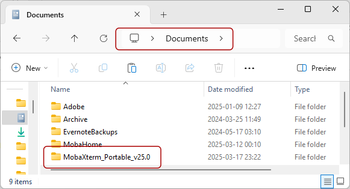
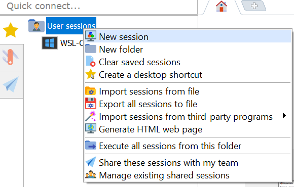
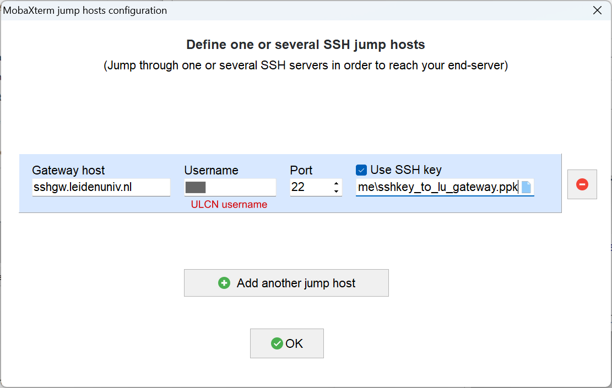
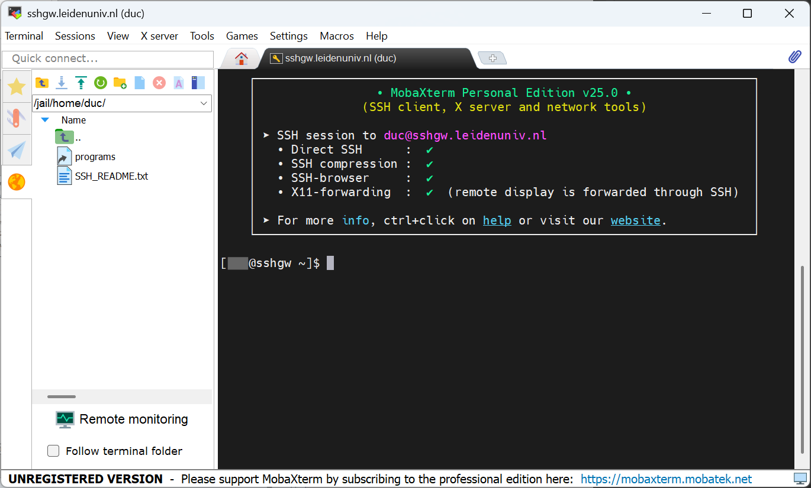

# MobaXterm setup

*By C.Du [@snail123815](https://github.com/snail123815)*

MobaXterm is a third-party terminal application for Windows. The program has a user friendly way of setting up SSH connections. Additionally, MobaXterm is bundled with **X11 server**, which allows you to run GUI applications on the remoter server and show the interface locally. With *X11 server*, you can run python or R plotting scripts and show the plots locally.

(In contrast, with a simple SSH connection, you can only save the plot to image files and then transfer them back to your local computer to view the result. Of course you can install standalone X11 server on your computer and make SSH connection work with it, it is not as handy.)

You can download MobaXterm home edition from [this link](https://mobaxterm.mobatek.net/download-home-edition.html). For university computers, please download the "Portable edition" on the left; for your own computer, both are fine.


## Portable edition

Please right click on the downloaded file, select "Extract all", select a good location to store extracted `MobaXterm_Portable_v*`. Can be in your "Documents" folder:



You can now enter the folder, right click on the executable file "MobaXterm_Personal_***.exe" and "Pin to Start" or "Send to" -> "Desktop (create shortcut)" to make it readily accessible.

## Start MobaXterm

Now start MobaXterm, I recommend one setup before continuing:  
Settings -> Configuration -> (tab General) -> Persistent home directory


Set it up in your Document directory.


After click OK, you should see:


Now restart MobaXterm as indicated.

```{admonition} For command line setup tutorial
:class: info
For CLI lovers, you can now generate a default "Shell" session:

Go to the main window of MobaXterm, click the "Star" icon on the left, right click on "User sessions", select "New session", select "Shell" from the top row of icons, click OK. Then follow [CLI SSH setup tutorial](./ssh%20access%20command%20line.md)
```

## Generate SSH key pairs

Start MobaXterm, look to the left, find the “Swiss Army Knife” icon (Tools) on the left, click on it, scroll to the bottom, find a tool called "MobaKeyGen (SSH key generator)", click on it to open.


Look at the bottom of the popup window, select "EdDSA" as encryption method (same as the command line `-t ed25519`), then click on "Generate".


Now move your mouse inside the box above randomly to generate some randomisation. You will see a progress bar, soon it will be done.

Then write your description in the "Key comment:" "My first key from my laptop to IBL servers"


Please open *notepad*, save the text in "Public key for pasting into ..." box by copy and paste, we will use this text later.

Then click "Save private key" to save the generated key pair. Click "Yes" when warned about "passphrase". Save with the file name "sshkey_to_ibl_servers" to your Persistent home directory or anywhere safe to yourself.


Now you can do the same to create another key pair. *For University managed desktop, skip generating this second key pair.*


Then click "Save private key" again to save the generated key pair. Click "Yes" when warned about "passphrase". Save with the file name "sshkey_to_lu_gateway" to the same directory.

Save the text in "Public key for pasting into ..." box text in notepad. Your notepad should have two lines of text, *one for University managed desktop*:


## Put public keys to servers

Now we need to make first connections to the servers, tell them that you have made some keys and locks (public keys), configure the public keys for them to recognise you.

### Create the target session

Go to the main window of MobaXterm, click the "Star" icon on the left, right click on "User sessions", select "New session".



A "Session settings" window will popup. Follow the numbers in the following screenshot to do the configuration. For Nr.6, setup the SSH key path to the "sshkey_to_ibl_servers.ppk" file saved in the previous step.

*For University managed desktop, you do not need to click on "Network settings", just click OK, then "Cancel" the immediate connection. Please read through the following content anyway and start following the tutorial at this step: [Configure IBL server public key](#configure-ibl-server-public-key)*

For others, continue to click on the "Network settings".


In the popup window, click "SSH gateway (jump host)"


Setup as the following screenshot. Select "Use SSH key" and setup the path to the file "sshkey_to_lu_gateway.ppk"



Now click OK -> OK go back to the main window. MobaXterm will start connecting immediately and start asking you for passwords. Please "Cancel" it. The session setup is done but the servers do not know our keys yet. You can, however, test your connections by continue using passwords to login. First your ULCN account password, then your IBL server password (probably you need to change it immediately, follow instructions on screen).

### Create gateway session

Now we need to setup a temporary session to the University gateway server. Follow the numbers in this screenshot to configure. **Please use your ULCN user name here.**


A warning will pop, showing it is your first time connecting to the server, please "Accept".


Then you will be asked to enter password, remember you are using your ULCN to connect to the gateway, please use ULCN password here.


```{admonition} Be careful
:class: warning
You can retry few times for the ULCN password, but keep in mind that the gate way will block you very soon when you tried too many times.
```

Then MobaXterm will ask you to save the password, select "No".


```{admonition} About saving password
:class: note
Since we are using SSH key pairs in this tutorial, saving the password for "password-less" login will cause MobaXterm to fall back to password login when the key pair setup is wrong. You will miss some debugging information.

It is possible though, to setup the connections to the gateway server and to IBL servers using saved password. Then you can forget about the SSH key pairs you generated. Please do encrypt the local password with a "Master Password" as indicated by MobaXterm. Then you only need to unlock the password in MobaXterm once in a while when making SSH connections.
```

Now you should be successfully enter the gateway



### Configure gateway public key

Now create a directory called `.ssh` by entering `mkdir .ssh` command, then enter the directory using `cd .ssh` command (cd for **c**hange **d**irectory). Remember to add a space ` ` between *program* and *arguments*. For example, `mkdir` is the program, and `.ssh` is its argument. Hit enter on your keyboard to execute each command.


Now enter `echo "`, do not hit enter yet. Go to your notepad, copy the second line:


Paste it into the command line.

```{admonition} Paste in MobaXterm
:class: note

If it is the first time you try to paste something into the command line, please right click in the command line window. A pop up will show.


Choose at your will. Please remember what you chose, it will become difficult if you forgot how to paste text into the command line. If you have the following window after click OK, it means you copied multiple lines:


A multi-line text will contain a hidden "carriage return" character (CR), which will act like you hit enter in the middle and execute the command that has already been entered. For our current operation, it does not matter because we have a quotation mark `"` before paste, the CR character will be pasted as is. It does not matter if you remove the CR or not. But for other commands, you might need to think about it, especially when the CR is at the end of your paste, you might execute the command accidentally. I would recommend you keep this warning message showing up in the future.
```

After pasting the public key, continue the command by entering `" >> authorized_keys`. Note the spaces in the command. Then hit enter to execute.  Now you should see a file called `authorized_keys` in `.ssh` folder. Show it use `ls` command. Then you can check the content of the file using `cat` command:


### Configure IBL server public key

Next, let us put the other public key on the IBL server. Since all IBL servers share the same credential, you can use the same key pair to access all of them. I suggest you do configuration on one server, then copy the `.ssh/authorized_keys` file to the same location on all other servers using `scp` command.

From the left of MobaXterm Window, click the "Star", then double click the session we created for IBL servers. It is the one with the IP address. We should be accepted by the gateway server and directly go to our target server. Our private key will be rejected by the target server because we haven't put our public key in `.ssh/authorized_keys` file yet. Enter the password provided by the registration email to login. If it is the first time you login, you will need to change the password immediately. Enter the old password again, then your own password twice to confirm.


Now do the same: create `.ssh` directory, enter `.ssh` directory, copy the public key saved earlier


Paste it into `authorized_keys` file:


Valid the execution


Now you can close all sessions, connect the target server again by double clicking the IP address session, you should be logged in directly without using any password.