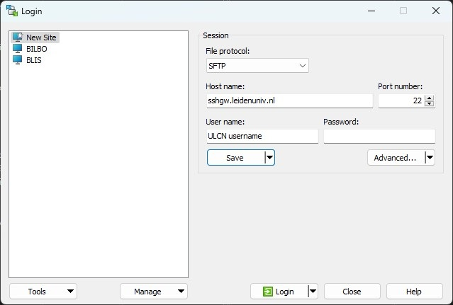
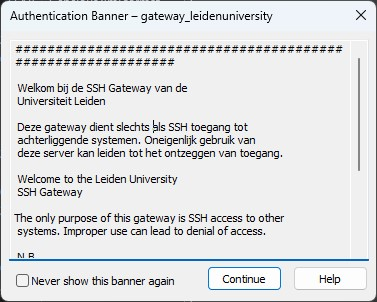
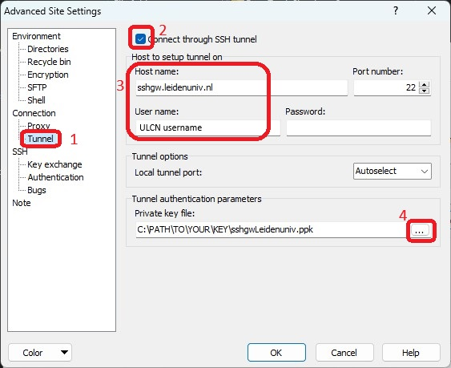
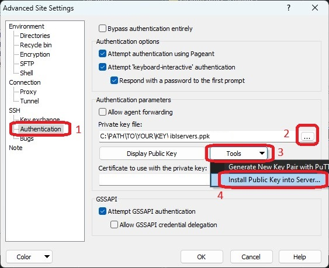

# WinSCP and PuTTY SSH access tutorial

*By C.Du [@snail123815](https://github.com/snail123815)*

```{contents}
---
depth: 3
---
```

There are many graphical user interface (GUI) software on the market you can use on Windows systems to make ssh connections. We choose [WinSCP](https://winscp.net/) and [PuTTY](https://putty.org/) because:

1. They are both open source and free software
2. On university provided computers, they are by default in your "Software centre". If not, file a request online from [ISSC helpdesk](https://helpdesk.universiteitleiden.nl/).

## Install both WinSCP and PuTTY

These software are open source and free for personal use. They provide **portable** programs, which means you can download it and run the program without installation, friendly to university/company computers where you cannot install program by yourself.

### WinSCP

WinSCP, as its name shows, "<u>Win</u>dows <u>s</u>afe <u>c</u>o<u>p</u>y", is only responsible for copying files to or from the server. It relies on the server to have "SFTP service". SFTP stands for "Secure file transfer protocol".

Use [this link to download WinSCP](https://winscp.net/eng/downloads.php). If you cannot install software, find the "Portable executables" download, and unzip it to any location that you choose and have access to store program.

WinSCP is essentially just a program allowing you to copy files from and to the server, you need PuTTY to connect to the shell environment of the server.

### PuTTY

PuTTY is the actual SSH client. WinSCP can setup the same connection configuration for PuTTY and can call PuTTY from its GUI.

For Leiden University provided computers, please find the latest version of both software in the software centre, install all of them.

For your own computer, you can download and install PuTTY either by downloading an installer from [Windows Store](https://apps.microsoft.com/store/detail/putty/XPFNZKSKLBP7RJ) (Windows 10 and later) or from [PuTTY official website](http://www.chiark.greenend.org.uk/~sgtatham/putty/latest.html). If you cannot install softwares on your computer, find "Alternative binary files", from the last one "putty.zip", download the zip file of corresponding architecture (usually 64-bit x86). Otherwise, you can just use the installer (package files).

If you downloaded "putty.zip", unzip it to a location you know, make sure you can execute putty.exe in the archive.

## Determine your network location

Check [this section](./ssh%20access.md#determine-your-network-location)

From an university managed desktop, you can [connect with a direct SSH connection](#make-direct-ssh-connection-using-winscp-university-desktop-with-powershell).

## If you need a gateway server

Check [Determine your network location](../IBL_servers/Intro.md#determine-your-network-location) to determine. You need to apply for Gateway access, check [Leiden University general purpose gateway](../IBL_servers/Intro.md#leiden-university-general-purpose-gateway)

## SSH connection through GUI

There is no guarantee that the procedure will be completely the same on your machine, if you find it strange, please read the screen and you should be able to sort out. If not, please make screen shots and create a "New issue" ([@snail123815](https://github.com/snail123815/IBL-bioinformatics-wiki/issues)) (or send me an email (c.du\[at\]biology.leidenuniv.nl) with your screen shots and detailed information).

### Create login profiles

Open WinSCP, a "Login" window appear. Fill in the form:

1. <u>H</u>ost name: 999.999.999.999 (replace this with one of the host IP provided in the registration email.)
2. <u>U</u>ser name: USERNAME (provided in the registration email)


Leave the password empty and click "<u>S</u>ave". In the pop up "Save session as site" window, change "<u>S</u>ite name" to the name of the server of the IP address.


Now do this again to create a site for gateway server, by using another set of <u>H</u>ost name and <u>U</u>ser name:

1. <u>H</u>ost name: sshgw.leidenuniv.nl (replace this with ALICE gateway if you use that)
2. <u>U</u>ser name: ULCN username (replace with ALICE username if you use ALICE gateway)




Your saved site will appear in the left panel.

### Generate key pairs


From the bottom left of the window, click "<u>T</u>ools", then "Run PuTTYgen"


A "PuTTY Key Generator" window will open, follow these steps:

1. Select "EdD<u>S</u>A" from the bottom "Parameters" section.
2. Click on "<u>G</u>enerate". Move your mouse in the window randomly until you see the "Key" section has been filled.
3. Edit "Key <u>c</u>omment" to "Describe the local computer" (for example "from my ASUS"). This key will be used to connect to the gateway server only.
4. "Save private key" to a safe location. Can be a "putty_keys" (create this directory by yourself) folder in your "Document" directory. Name the private key as "sshgwLeidenuniv.ppk" (name it otherwise if you use ALICE gateway). You will see a "PuTTYgen Warning" for save the private key without a passphrase, you can continue by select "Yes". Otherwise you will need to fill in passphrase in the generator window, then be prompted every time when you connect using this key.


Don't close this window. Now click "<u>G</u>enerate" again, repeat step 2, generate another key, edit "Key <u>c</u>omment" with the same comment. Then save private key as "iblservers.ppk".

```{admonition} .ppk file
PuTTY User Key File. It contains information for both public key and private key, thus actually a "key pair" file.
```

Now you can close the "PuTTY Key Generator" window and will go back to the Login window.

### Let server recognise your key

Now the keys are only on your local computer, both gateway server and our IBL server does not know you have the keys and will not open the door for you.

#### Push key to gateway server

```{admonition} Alternative
This method depends on some components on server side, and may not work for new user on our University gateway server. If it fails, check [Configure gateway public key](./ssh%20access%20mobaxterm.md#configure-gateway-public-key)
```

Select the gateway name you just saved from the left side, then click "Edit" in the right side, then click "Advanced..." button.


In the "Advanced Site Settings" window:

1. Select "authentication" from the left panel.
2. In "Authentication parameters" section, click the small "..." button, "Open" previously saved `.ppk` file "sshgwLeidenuniv.ppk" (or your ALICE gateway key file).
3. Click "Tools"
4. Select "Install Public Key into Server...", check if it is still the "sshgwLeidenuniv.ppk" file, then click "Open".


You will be prompt to enter your ULCN password (ALICE password if you use ALICE gateway). Fill it in and click "OK".


You should see "Information" window telling you "Public key "from my ASUS" was installed.", click "OK".


Then click "OK" in the "Advanced Site Settings" window. You will be back to the "Login" window, click "Save" to save your changes.

Now the "Login" button on the bottom should be green , click it to test. If success, you should not be promoted to enter the password again (except if you set passphrase while generating key file) and will be promoted with the following "Authentication Banner".



You can tick the box "Never show this banner again", but you will miss notifications from the gateway server. Click "Continue", you will see an "Error", don't panic, this is expected. The gateway usually does not run an SFTP server.


Click "OK". You should be back to the "Login" window.

#### Push key to IBL server

Now we need to do the same to setup IBL servers. This has to be done after you pushed a key to the gateway server.

Select the IBL server name you just saved from the left side, then click "Edit" in the right side, then click "Advanced..." button.


In the "Advanced Site Settings" window:

1. Select "Tunnel" from the left panel.
2. Tick the checkbox "Connect through SSH tunnel"
3. In "Host to setup tunnel on" section, fill in the server address "sshgw.leidenuniv.nl" and your ULCN username (Or ALICE gateway server and your ALICE username if you use ALICE gateway).
4. Click the small "..." button in "Tunnel authentication parameters" section, "Open" previously saved `.ppk` file "sshgwLeidenuniv.ppk" (or your ALICE gateway key file).



5. Select "authentication" from the left panel.
6. In "Authentication parameters" section, click the small "..." button, "Open" previously saved `.ppk` file "iblservers.ppk".
7. Click "Tools"
8. Select "Install Public Key into Server...", check if it is still the "iblservers.ppk" file, then click "Open". Click "Continue" for the "Authentication Banner"


You will be prompt to enter your IBL server password (you get it from the registration email). Fill it (better to copy it directly from the email) in and click "OK".


Then you will see "Password expired. Change your password now.", it is asking for "Current Password", fill in the password from email again. Then the program will ask you to enter new password, fill your own password and click "OK", then repeat it, click "OK" again.


You should see "Information" window telling you "Public key "from my ASUS" was installed.", click "OK".


Then click "OK" in the "Advanced Site Settings" window. You will be back to the "Login" window, click "Save" to save your changes.

Now the "Login" button on the bottom should be green , click it to test. If success, you should not be promoted to enter the password again (except if you set passphrase while generating key file).

### How to use

Now that you have setup everything. After you click , you should see the main window of WinSCP.


On the left side, you can navigate to the files and folders on your local machine. On the right side, you can navigate within our server. You can drag and drop files between each other.

However, this is only connected to the SFTP server. To actually operate on the server, you need to click the PuTTY icon:


:::{NOTE}

If PuTTY executable is at expected location (meaning you used a installer and chose the default installation location), it should work by default.

If your PuTTY is not "installed" but can be only executed from unzipped "putty.exe" (portable version), WinSCP will tell you it cannot find putty executable. Do not panic. Go to WinSCP preferences and "Browse" to find the full path of your "putty.exe" file:


Then the PuTTY icon should work.
:::

A "PuTTY Security Alert" will appear, asking you if you trust this server. Click "<u>A</u>ccept" to trust it. Then you will see a terminal window:


Congratulations! You have finished all setup. You can repeat the procedure for other servers if you need them. Below is a simplified tutorial when you don't need a gateway server to connect.

## Make direct SSH connection using WinSCP (University Desktop with PowerShell)

Find both PuTTY and WinSCP in your "Software Centre" and install them.

Open WinSCP, a "Login" window appear. Fill in the form:

1. <u>H</u>ost name: 999.999.999.999 (replace this with one of the host IP provided in the registration email.)
2. <u>U</u>ser name: USERNAME (provided in the registration email)


Leave the password empty and click "<u>S</u>ave". In the pop up "Save session as site" window, change "<u>S</u>ite name" to the name of the server of the IP address.


Your saved site will appear in the left panel.

Now generate SSH key pair.


From the bottom left of the window, click "<u>T</u>ools", then "Run PuTTYgen"


A "PuTTY Key Generator" window will open, follow these steps:

1. Select "EdD<u>S</u>A" from the bottom "Parameters" section.
2. Click on "<u>G</u>enerate". Move your mouse in the window randomly until you see the "Key" section has been filled.
3. Edit "Key <u>c</u>omment" to "key from my university PC".
4. "Save private key" to a safe location. Can be a "putty_keys" (create this directory by yourself) folder in your "Document" directory. Name the private key as "iblservers.ppk". You will see a "PuTTYgen Warning" for save the private key without a passphrase, you can continue by select "Yes". Otherwise you will need to fill in passphrase in the generator window, then be prompted every time when you connect using this key.


```{admonition} .ppk file
PuTTY User Key File. It contains information for both public key and private key, thus actually a "key pair" file.
```

Now you can close the "PuTTY Key Generator" window and will go back to the Login window. Next step, we need to push the generated key to IBL servers.

Select the IBL server name you just saved from the left side, then click "Edit" in the right side, then click "Advanced..." button.


In the "Advanced Site Settings" window:

1. Select "authentication" from the left panel.
2. In "Authentication parameters" section, click the small "..." button, "Open" previously saved `.ppk` file "iblservers.ppk".
3. Click "Tools"
4. Select "Install Public Key into Server...", check if it is still the "iblservers.ppk" file, then click "Open". Click "Continue" for the "Authentication Banner"



You will be prompt to enter your IBL server password (you get it from the registration email). Fill it (better to copy it directly from the email) in and click "OK".


Then you will see "Password expired. Change your password now.", it is asking for "Current Password", fill in the password from email again. Then the program will ask you to enter new password, fill your own password and click "OK", then repeat it, click "OK" again.


You should see "Information" window telling you "Public key "key comment" was installed.", click "OK".


Then click "OK" in the "Advanced Site Settings" window. You will be back to the "Login" window, click "Save" to save your changes.

Now the "Login" button on the bottom should be green , click it to test. If success, you should not be promoted to enter the password again (except if you set passphrase while generating key file).

Now that you have setup everything. After you click , you should see the main window of WinSCP.


On the left side, you can navigate to the files and folders on your local machine. On the right side, you can navigate within our server. You can drag and drop files between each other.

However, this is only connected to the SFTP server. To actually operate on the server, you need to click the PuTTY icon:


A "PuTTY Security Alert" will appear, asking you if you trust this server. Click "<u>A</u>ccept" to trust it. Then you will see a terminal window:


Congratulations! You have finished all setup. You can repeat the procedure for other servers if you need them. 

## No Guarantee

There is no guarantee that the procedure will be completely the same on your machine, if you find it strange, please read the screen and you should be able to sort out. If not, please make screen shots and create a "New issue" ([@snail123815](https://github.com/snail123815/IBL-bioinformatics-wiki/issues)) (or send me an email (c.du\[at\]biology.leidenuniv.nl) with your screen shots and detailed information).