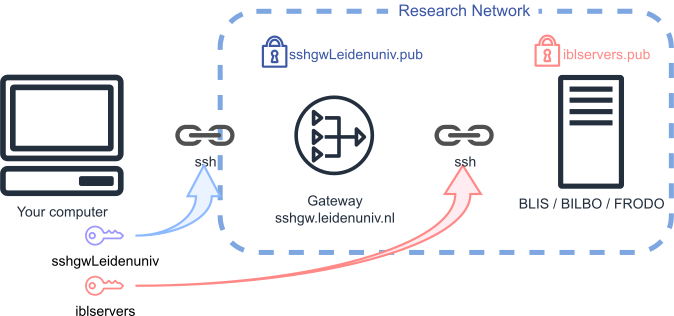

# SSH basics

*By C.Du [@snail123815](https://github.com/snail123815), Edder Bustos Diaz [@EdderDaniel](https://github.com/EdderDaniel)*

```{contents}
---
depth: 3
---
```

## What is SSH

SSH, or Secure Shell, is a way to securely connect to another computer over the internet. It keeps your information safe by encrypting everything you send and receive, so no one else can read it. With SSH, you can log into another computer, run commands, transfer files, and manage services securely.

Think of SSH as a secure tunnel between your computer and another computer. It uses special ***SSH keys*** to ensure that only you can access the other computer, and no one can listen in on your connection.

SSH connection is the only recommended way to connect to our servers. There are two ways of making a SSH connection, one is through password, that the server asks for password every time you login. Most of us will need to jump through the University gateway server, using password means you need to enter your ULCN password to connect to the gateway, then enter your IBL server password to access IBL servers. Thus, we recommend using the second way of making SSH connection, which include generating SSH keys and then use these keys to access the servers. Please store your private keys safely.

### SSH keys

Although only keys are mentioned everywhere, you can think of every key as having a corresponding "lock". For SSH connections, you need a **key pair**, which consists of a **private key** and a **public key**. You can consider the public key as a "lock" that is stored on the remote server.

When you request a connection to the remote server, you present the server with the **signature** of your private key (not the key itself). The server then checks if this signature matches the public key you stored earlier. If they match, the server grants you access. Otherwise, you will be rejected and need to try another method to connect, such as providing a username and password. Once connected, all communication will be encrypted using the private and public keys.

You usually generate key pairs yourself using an "SSH key generator". Examples of such generators are `ssh-keygen` and "MobaKeyGen".


### SSH gateway

This concept is a bit complex, but we only need to understand the basics, keep calm and continue.

In order to be able to connect to our servers from anywhere and at the same time keep our Research Network safe and stable our University has set up a **Gateway** server. The sole purpose of the Gateway server is to act as a gatekeeper for SSH connections. All SSH connections must go through this server. If the gateway server is attacked, the servers inside the Research Network will remain safe.

To go through the gateway server, we first need to connect to the gateway using SSH.

We will need to provide a private key to the gateway, and if that is accepted, we will be able to provide a private key to our IBL servers. The two keys provided can be the same, but since the gateway server can be accessed through the *dangerous* internet, it is recommended to use different key pairs.



## Determine your network location

[Determine your network location](../IBL_servers/Intro.md#determine-your-network-location)

If you are working on your own computer, you will **never** be inside the Research Network, so you will need to jump through the SSH gateway even when you are physically in the university. A university-managed laptop will still be outside of the Research Network once you leave the university area.

- Outside of the Research Network = make SSH connection through the SSH gateway.
- Only from a university-managed **desktop**, you can use a direct SSH connection.

## CLI or GUI?

To use our Linux servers, you'll need access to a <u>c</u>ommand <u>l</u>ine <u>i</u>nterface (CLI). Just to make a connection, you can use both CLI and **g**raphical <u>u</u>ser <u>i</u>nterface (GUI).

For those who would like to go for a more seamless workflow, or if you are a MacOS user, please follow the [command line SSH connection tutorial](./ssh%20access%20command%20line.md).

For others who would like to have more graphical inspiration, and are working with the Windows operating system, please follow the [MobaXterm SSH connection tutorial](./ssh%20access%20mobaxterm.md).

The setup will be very different on different systems. I will briefly touch upon the topic of differences between Windows and "Unix-like" MacOS/Linux systems in this tutorial.

## Get help

There is no guarantee that the procedure will be completely the same on your machine. If you find it strange, please read carefully what is shown on the screen and you should be able to sort it out. An AI chatbot should also solve most of the problems. If not, please make sure you gather enough information for troubleshooting, e.g. steps you have done, the output or error messages, and a few screenshots, etc. With this information, you can search for the solved issues in our [ibl-bioinformatics-wiki](https://github.com/ibl-bioinfo/IBL-bioinformatics-wiki/issues) or ask for help in our SLACK group. If none of those works, create a "[New issue](https://github.com/ibl-bioinfo/IBL-bioinformatics-wiki/issues)".